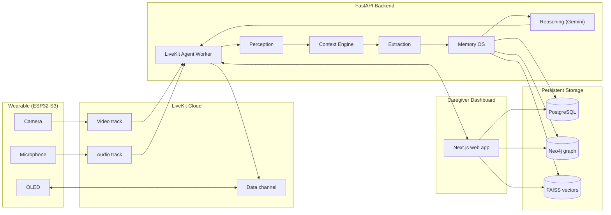
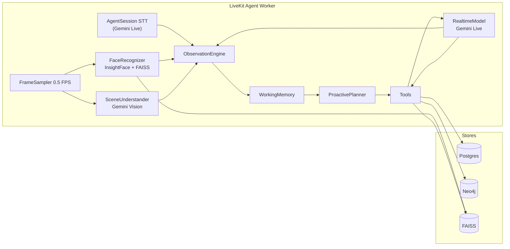
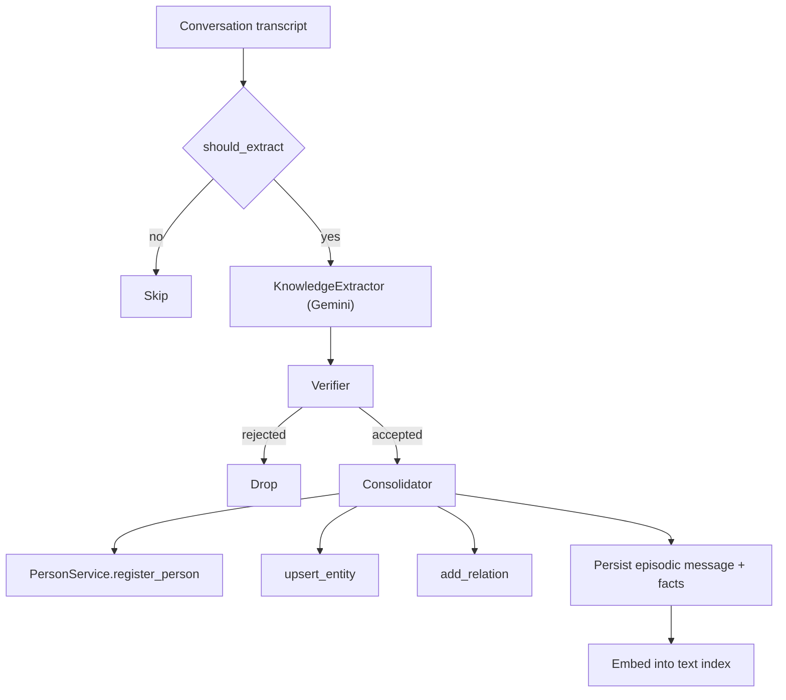
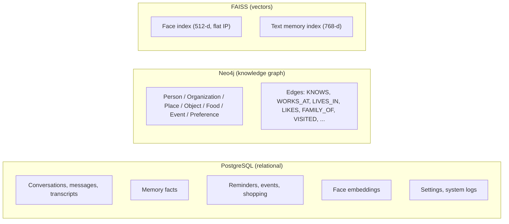
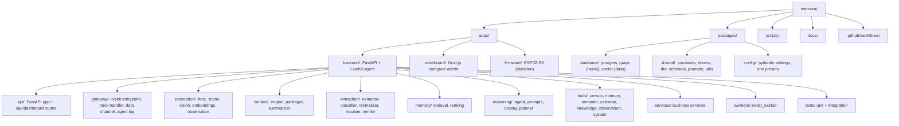

# Memora

Context-aware AI memory assistant for people living with dementia. A wearable ESP32-S3 streams camera and audio to the cloud through LiveKit; a FastAPI backend performs face recognition, scene understanding, and speech transcription, builds long-term memories (semantic + episodic), and reasons with Gemini to answer questions and proactively remind — all surfaced in real time to a multi-caregiver web dashboard.

Python + C++ monorepo. Backend (FastAPI + LiveKit agent), web dashboard (Next.js), and ESP32-S3 firmware (skeleton).

## Background

Dementia affects more than 2 million people in Indonesia as of 2025, with over 30% of nearly 7 million elderly Indonesians showing signs of cognitive impairment (Ministry of Health, 2026). Alzheimer's accounts for 60–70% of cases, marked by progressive memory loss and difficulty recognizing familiar people and surroundings. Formal diagnosis and specialist care remain concentrated in major urban centers, leaving families in under-served regions to navigate this decline largely on their own.

Conventional aids — calendars, sticky notes, generic reminder apps — rely on manual schedules and depend entirely on caregiver input. AI-powered wearable assistants have emerged abroad but remain purely reactive and built around a single in-home caregiver, a structure that doesn't reflect Indonesian families where care is often shared across relatives who don't live under the same roof.

Memora combines real-time facial and object recognition with natural voice interaction to help patients recognize familiar faces, places, and daily routines the moment confusion occurs — without needing to remember to ask for help. A connected caregiver dashboard shares this in real time with every family member involved in care, replacing the single-caregiver assumption with one built for how Indonesian families actually share care.

## Business Model

Memora uses a hybrid revenue model: a **one-time hardware purchase** combined with a **monthly subscription** for the AI service, sold through two channels.

### B2C — Direct to Family

Glasses sold near break-even as an entry point, with 0% installment options (3–6 months via Kredivo/Akulaku) to ease the price barrier for middle-class families. Revenue comes from three subscription tiers:

| Tier    | Includes                                                                  |
| ------- | ------------------------------------------------------------------------- |
| Basic   | Face recognition, voice assistance, basic reminders (one caregiver)       |
| Family  | Adds real-time multi-caregiver dashboard + disorientation/location alerts |
| Family+ | Adds long-term memory history, weekly reports, priority support           |

### B2B — Hospital & Institutional

Glasses leased in bulk at lower per-unit cost on contract terms that suit hospital budget cycles, plus a per-bed/per-patient monthly dashboard license for staff monitoring multiple patients (per-seat SaaS pricing). An optional anonymized, consent-based data/insight partnership for clinical research adds long-term differentiation.

### Pricing

| Component           | Price        |
| ------------------- | ------------ |
| Smart Glasses       | USD 140      |
| AI Subscription     | USD 11/month |
| Annual Subscription | USD 132      |
| **First-Year ARPU** | **USD 275**  |

### Go-to-Market

1. **Pilot & Validation (Month 0–6)** — 1–2 hospitals in Greater Jakarta, 10–20 dementia patients; collaborate with caregiver communities (e.g. ALZI).
2. **Direct-to-Consumer Awareness (Month 6–12)** — B2B2C via hospitals/clinics, educational campaigns targeting the sandwich generation (30–50 year-olds caring for aging parents). Target ~4,000 adopters in year one.
3. **Scale & Institutional Expansion (Month 12+)** — Expand partnerships with hospitals, insurers, and elderly care centers; introduce regional language support.

## Architecture



## Components

### LiveKit agent worker

A standalone process (`apps/backend/workers/livekit_worker.py`) runs the `livekit-agents` server. Per room, `gateway/livekit/entrypoint.py`:

- Connects to the room with auto-subscribe.
- Builds the face repository, memory session (episodic), and tools.
- Streams the incoming video track through a `FrameSampler` (~0.5 FPS) and feeds frames to `FaceRecognizer` (InsightFace, CPU) and `SceneUnderstander` (Gemini Vision).
- Uses `AgentSession` + Google `RealtimeModel` for speech in/out, VAD turn detection, and transcription (`user_input_transcribed`).
- Pushes observations into the `ObservationEngine`, which fuses them into a `CurrentContext` (visible people, scene, ongoing speech, device state).
- Wires the `MemoraAgent` with all tool declarations and a `ProactivePlanner` loop.
- Replies over the data channel: `display` (OLED), `agent_log` (dashboard log pane), `prompt` (incoming user text).



### Perception

| Module                                     | What it does                                                                                                                                      |
| ------------------------------------------ | ------------------------------------------------------------------------------------------------------------------------------------------------- |
| `perception/face/recognizer.py`            | InsightFace `buffalo_l` (CPU) face detection + 512-d embeddings. Lazy singleton, recycles ONNX session every 30 calls to avoid a CPU memory leak. |
| `perception/face/tracker.py`               | IoU-based cross-frame identity continuity (implemented, not yet wired into the entrypoint).                                                       |
| `perception/scene/understander.py`         | Gemini Vision (`GEMINI_TEXT_MODEL`) scene JSON: `{location, objects, activity, confidence}`.                                                      |
| `perception/vision/sampler.py`             | Async `FrameSampler` at `FRAME_SAMPLE_FPS` (~0.5) from the LiveKit video stream.                                                                  |
| `perception/embeddings/text_embeddings.py` | Gemini `text-embedding-004` (768-d) for memory/text similarity.                                                                                   |
| `perception/speech/`                       | Delegated to `AgentSession` (Gemini Live) transcription — no local STT module.                                                                    |
| `perception/observation/`                  | `ObservationEngine` (async queue + fusion window) and `WorkingMemory` (30 s TTL).                                                                 |

### Context, extraction, memory

- `context/` — `ContextEngine` retrieves + ranks candidates, folds in upcoming reminders, packages and summarizes (Gemini) the context text into a compact `ContextPackage`.
- `extraction/` — the memory pipeline gate: `should_extract` filter, `KnowledgeExtractor` (Gemini → entities/relationships/facts), `classifier`, `normalizer` (canonical names), `resolver` (alias/duplicate detection), `verifier` (confidence → ACCEPT / LOWER / REJECT).
- `memory/retrieval/` — `Retriever`: graph name search, visible-person entities, recent episodic sessions, optional FAISS text search.
- `memory/ranking/` — `Ranker` scores candidates: semantic 0.30, temporal 0.20, social 0.20, spatial 0.10, confidence 0.10, frequency 0.10.
- `pipeline/` — `PipelineRunner` orchestrates extraction → consolidation; `Consolidator` verifies, registers people/entities/relationships, persists episodic messages and facts, embeds facts into the text index.



### Reasoning

`reasoning/agent/agent.py` — `MemoraAgent` wraps Google `RealtimeModel` (`GEMINI_LIVE_MODEL`, voice "Puck"). Auto-builds function-tool handlers from `ALL_FUNCTION_DECLARATIONS` and dispatches to the tool registry. `reasoning/prompts/` builds the Bahasa Indonesia system instruction. `reasoning/response/display.py` pushes OLED text. `reasoning/planner/` runs the 30 s proactive loop.

Tools (`apps/backend/tools/`): `person`, `memory`, `reminder`, `calendar` (events + shopping), `knowledge` (graph queries), `observation` (scene/people/activity), `system` (battery/network/device).

### Web dashboard

`apps/dashboard` — Next.js 15 (App Router) caregiver admin dashboard, light-mode purple theme (Poppins + JetBrains Mono, Tailwind v4).

Pages under `(dashboard)/`: Overview (`/`), Knowledge Graph, Memories, Conversations, Persons, Reminders, Settings. `/debugging` (outside the shell) hosts a LiveKit dummy-device test harness. A `POST /api/token` route mints LiveKit access tokens and dispatches the agent.

The browser never talks to the backend directly: `next.config.ts` rewrites `/api/dashboard/*` to `NEXT_PUBLIC_BACKEND_URL`. The knowledge graph page renders Neo4j data via `react-force-graph-2d`.

### Storage



## Stack

- **Backend** — Python 3.12+, FastAPI 0.141, uvicorn, `livekit-agents` (Google realtime model), InsightFace (CPU), FAISS, Gemini
- **Dashboard** — Next.js 15 (App Router), React 19, Tailwind v4, `react-force-graph-2d`, `livekit-client`
- **Firmware** — C++ / PlatformIO (ESP32-S3) — currently a skeleton
- **Databases** — Postgres 18 (relational), Neo4j 5 (memory graph), FAISS (vector search)
- **LLM** — Gemini Live (realtime), Gemini Flash (extraction / scene / summarization), `text-embedding-004`
- **Package managers** — uv (Python), bun (JS)
- **Monorepo** — Nx + `@nxlv/python`
- **Lint/format** — Ruff (Python), Prettier (JS/YAML/MD/TOML)
- **Git hooks** — Husky + lint-staged

## Repository structure



## Prerequisites

- [uv](https://docs.astral.sh/uv/) >= 0.5
- [bun](https://bun.sh/) >= 1.3
- Docker (for Postgres/Neo4j via docker-compose)
- [PlatformIO](https://platformio.org/) CLI (firmware only)

## Getting started

Install JS tooling and sync the Python workspace:

```bash
bun install
uv sync
```

Start the databases (Postgres + Neo4j):

```bash
bun run db:start
```

Copy `.env.example` to `apps/backend/.env` and fill in the required LiveKit / Gemini / database keys:

```bash
cp .env.example apps/backend/.env
```

Run the backend API (FastAPI on <http://localhost:8000>):

```bash
bun run dev:backend
```

Run the LiveKit agent worker (needs LiveKit keys):

```bash
bunx nx dev backend-worker
```

Run the dashboard (Next.js on <http://localhost:3000>):

```bash
bunx nx dev dashboard
```

Run all three at once (dashboard + backend + worker):

```bash
bun run dev
```

## Databases

| Service  | Port                     | Purpose                                      |
| -------- | ------------------------ | -------------------------------------------- |
| Postgres | 5432                     | Relational storage, repositories, migrations |
| Neo4j    | 7474 (HTTP), 7687 (Bolt) | Memory graph (semantic + episodic)           |
| FAISS    | —                        | In-process vector index (no container)       |

Default credentials: Postgres `postgres` / `password`, Neo4j `neo4j` / `memora123`. Override via `POSTGRES_PASSWORD` and `NEO4J_PASSWORD` env vars.

Env file: `apps/backend/.env` (optional; docker-compose injects sensible defaults).

## Environment

Required (fail loudly at startup): `LIVEKIT_URL`, `LIVEKIT_API_KEY`, `LIVEKIT_API_SECRET`, `GEMINI_API_KEY`, `DATABASE_URL`, `NEO4J_URI`, `NEO4J_USER`, `NEO4J_PASSWORD`.

Notable defaults in `packages/config/env/settings.py`:

- `GEMINI_LIVE_MODEL=gemini-2.5-flash-native-audio-preview-12-2025`
- `GEMINI_TEXT_MODEL=gemini-2.5-flash`
- `FRAME_SAMPLE_FPS=0.5` (InsightFace ONNX leaks ~20 MB/frame on CPU; 1 FPS OOMs)
- `FACE_MATCH_THRESHOLD=0.50`, `FACE_POSSIBLE_MATCH_THRESHOLD=0.35`
- `LOCAL_TIMEZONE=Asia/Jakarta`
- `AGENT_NAME=memora-agent-<hostname>` (must match `AGENT_NAME` in `apps/dashboard/.env`)

Dashboard public env: `NEXT_PUBLIC_BACKEND_URL`, `NEXT_PUBLIC_LIVEKIT_URL`, `NEXT_PUBLIC_WORKER_HEALTH_URL`. Server env: `LIVEKIT_URL`, `LIVEKIT_API_KEY`, `LIVEKIT_API_SECRET`, `AGENT_NAME`.

## Available scripts

| Script                       | Description                                |
| ---------------------------- | ------------------------------------------ |
| `bun run dev`                | Start dashboard + backend + worker (nx)    |
| `bun run dev:backend`        | Start FastAPI backend (uvicorn, reload)    |
| `bunx nx dev backend-worker` | Start the LiveKit agent worker             |
| `bunx nx dev dashboard`      | Start the Next.js dashboard                |
| `bun run dev:firmware`       | Build/watch firmware via PlatformIO        |
| `bun run build`              | Build all Python packages + dashboard (nx) |
| `bun run install:py`         | Sync all Python workspace members          |
| `bun run lint`               | Ruff check                                 |
| `bun run lint:fix`           | Ruff check + autofix                       |
| `bun run format`             | Ruff format + Prettier write               |
| `bun run format:check`       | Verify formatting (ruff + prettier)        |
| `bun run db:start`           | Start Postgres + Neo4j containers          |
| `bun run db:stop`            | Stop Postgres + Neo4j                      |
| `bun run db:down`            | Remove all containers                      |
| `bun run db:migrate`         | Run Alembic migrations (database package)  |
| `bun run docker:build`       | Build Docker Compose images                |
| `bun run docker:up`          | Build + start Docker Compose stack         |
| `bun run docker:down`        | Stop Docker Compose stack                  |
| `bun run docker:logs`        | Tail Docker Compose logs                   |

## Backend API

`GET /health` — checks Postgres, Neo4j, and FAISS.

The dashboard router is mounted under `/api/dashboard` (all read-only GET, no auth — local caregiver tool):

| Endpoint                                         | Description                                    |
| ------------------------------------------------ | ---------------------------------------------- |
| `GET /api/dashboard/graph`                       | Full Neo4j knowledge graph                     |
| `GET /api/dashboard/persons`                     | Person nodes enriched with face-capture counts |
| `GET /api/dashboard/memories`                    | Recent memory facts (optional `person_id`)     |
| `GET /api/dashboard/conversations`               | Episodic conversation sessions                 |
| `GET /api/dashboard/conversations/{id}/messages` | Transcript of a session                        |
| `GET /api/dashboard/reminders/today`             | Today's reminders                              |
| `GET /api/dashboard/reminders/upcoming`          | Upcoming reminders                             |
| `GET /api/dashboard/events/upcoming`             | Upcoming calendar events                       |
| `GET /api/dashboard/shopping`                    | Shopping list                                  |
| `GET /api/dashboard/settings`                    | Key/value settings                             |
| `GET /api/dashboard/health`                      | Same as root `/health`                         |

## Nx targets

Python projects expose `install`, `build`, `dev`, `migrate` targets. Run across all:

```bash
bunx nx run-many -t build --exclude=tag:firmware
bunx nx run-many -t install
```

Per project:

```bash
bunx nx build database
bunx nx dev backend
bunx nx migrate database
bunx nx build dashboard
```

Firmware (`pio` via nx): `nx build firmware`, `nx upload firmware`, `nx monitor firmware`.

## CI

`.github/workflows/ci.yml` runs on push/PR to `main`/`master`:

1. **Lint** — Ruff check + format, Prettier check
2. **Build** — `uv sync` + `nx run-many -t build` (excludes firmware)
3. **Unit tests** — `pytest apps/backend/tests/unit/`
4. **Migration test** — Postgres 18, `alembic upgrade head` + migration verifier
5. **Integration tests** — Postgres 18 + Neo4j 5, `pytest apps/backend/tests/integration/`
6. **Docker build** — backend image
7. **Dashboard build** — Next.js standalone + dashboard image

Deployment is handled by Railway (no deploy workflow in-repo).

## Deployment

Docker Compose for local/full-stack (backend + worker + Postgres + Neo4j):

```bash
bun run docker:up
bun run docker:logs
```

Production deploy via [Railway](https://railway.com):

- **backend** service — `apps/backend/railway.json`, start `uvicorn app:app --host 0.0.0.0 --port 8000 --app-dir apps/backend`
- **worker** service — `apps/backend/railway.worker.json`, start `python -m workers.livekit_worker start`
- **dashboard** service — `apps/dashboard/railway.json`, builds the Next.js standalone image

## Git hooks

Husky pre-commit runs lint-staged: Ruff fix + format on `.py`, Prettier on JS/TS/YAML/JSON/MD/TOML. Initialize with `bun run prepare` (runs automatically on `bun install`).

## Current status

- Backend, LiveKit agent, memory pipeline, and dashboard are implemented and tested.
- `scripts/` (deploy/dev/benchmark/migrate/seed) are empty scaffolding placeholders.
- The ESP32-S3 firmware is a skeleton (empty `main.cpp` and module stubs; `platformio.ini` not yet configured).
- `whisper` is a declared dependency but unused (STT is handled by Gemini Live); `models/whisper/` is empty.
- `perception/face/tracker.py` is implemented with a self-check but not yet wired into the live entrypoint.
