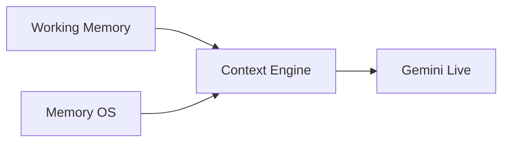
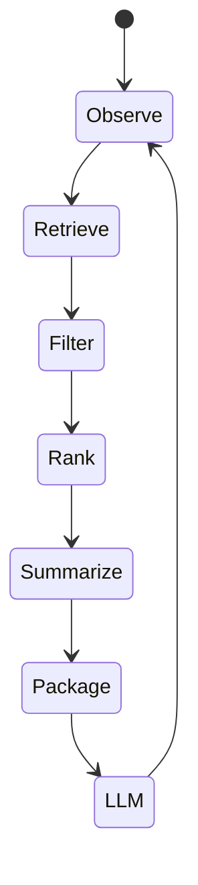
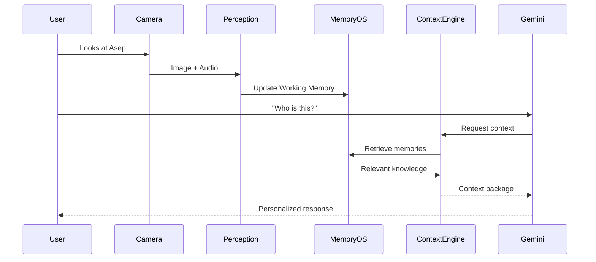

# Context Engine PRD

**Version:** 1.0  
**Status:** Draft  
**Owner:** AI Platform Team

---

# 1. Overview

The Context Engine is responsible for transforming the user's current situation into an optimized context package for the reasoning model.

Instead of sending the entire Memory OS to the Large Language Model (LLM), the Context Engine selectively retrieves, filters, ranks, summarizes, and assembles only the information that is relevant to the current interaction.

The Context Engine acts as the bridge between long-term memory and reasoning, ensuring that the LLM receives concise, personalized, and contextually appropriate information while minimizing token usage.

---

# 2. Objectives

The Context Engine is designed to:

- Retrieve only relevant memories.
- Minimize LLM context size.
- Improve response personalization.
- Reduce hallucinations.
- Support multimodal context.
- Prioritize important memories.
- Enable scalable lifelong memory.

---

# 3. High-Level Architecture



---

# 4. Internal Pipeline


---

---

# 5. Realtime Processing Strategy

Unlike navigation assistants or obstacle detection systems, the proposed solution is designed as a **cognitive memory assistant** rather than a real-time safety-critical system.

Therefore, the architecture intentionally prioritizes contextual understanding over high-frame-rate visual processing.

## Visual Processing

The wearable continuously streams video through LiveKit. However, only a subset of frames is selected for AI inference.

The **Frame Sampler** periodically extracts approximately **one frame per second (≈1 FPS)** and forwards it to the perception pipeline.

```
Camera (30 FPS)
        │
        ▼
Frame Sampler
        │
        ├── Frame #1
        ├── Frame #30
        ├── Frame #60
        ├── Frame #90
        ▼
Perception Pipeline (~1 FPS)
```

This significantly reduces:

- AI inference cost
- Network bandwidth
- Cloud GPU utilization
- Memory processing overhead

while remaining sufficient for recognizing people, understanding conversations, and building long-term memories.

---

## Why ~1 FPS?

The primary objective of the system is **memory augmentation**, not immediate environmental awareness.

Typical use cases include:

- Identifying familiar people.
- Remembering previous conversations.
- Recording important events.
- Building long-term memories.
- Providing contextual reminders.

These tasks evolve over seconds rather than milliseconds.

For example:

- Looking at someone's face for two seconds is sufficient for identity recognition.
- Conversations typically span several minutes.
- Important memories develop over entire interactions rather than individual frames.

Consequently, processing one representative frame per second provides enough visual information while dramatically improving efficiency.

---

## LLM Processing Frequency

Similarly, the reasoning engine does **not** continuously invoke Gemini Live for every incoming frame.

Instead, Gemini Live is activated only when one or more of the following events occur:

- A new person is detected.
- A new conversation begins.
- The user explicitly asks a question.
- Important contextual changes are observed.
- A reminder or scheduled event becomes relevant.

This event-driven reasoning strategy minimizes unnecessary API calls while maintaining responsive interactions.

---

## Design Rationale

The proposed processing strategy intentionally trades high frame rate for richer contextual understanding.

Rather than processing 30 visual observations every second, the system focuses on extracting meaningful experiences that contribute to persistent long-term memory.

This approach aligns with the project's objective of functioning as a lifelong cognitive companion instead of a real-time navigation assistant.

# 6. Inputs

The Context Engine combines multiple information sources.

## Current Working Memory

Current observations.

Examples:

- Visible people
- Current location
- Conversation transcript
- User activity
- Current reminder

---

## Long-Term Memory

Retrieved from Memory OS.

Examples:

- Personal profiles
- Relationships
- Preferences
- Historical conversations
- Daily routines

---

## User Request

Examples

> "Who is this?"

> "What should I buy?"

> "What did we discuss yesterday?"

---

## Device Context

Examples

- Current time
- Battery level
- Network availability
- Active sensors

---

# 7. Memory Retrieval

The Retrieval module determines which memories should be considered.

Retrieval sources include:

- Semantic Memory
- Episodic Memory
- Knowledge Graph
- Face Recognition
- Calendar
- Reminder System

Multiple retrieval strategies may be combined.

---

# 8. Context Filtering

Not every retrieved memory should reach the LLM.

Filtering removes:

- Duplicate facts
- Outdated information
- Irrelevant memories
- Low-confidence memories
- Excessively detailed history

The objective is to maximize information density.

---

# 9. Memory Ranking

Remaining memories are ranked according to relevance.

Signals include:

| Signal              | Description                    |
| ------------------- | ------------------------------ |
| Semantic Similarity | Related to current topic       |
| Temporal Relevance  | Recent memories                |
| Social Relevance    | Related to nearby people       |
| Spatial Relevance   | Related to current location    |
| Importance Score    | Memory priority                |
| Confidence Score    | Extraction confidence          |
| Frequency           | Frequently referenced memories |

The ranking algorithm produces the optimal memory subset for the reasoning engine.

---

# 10. Context Summarization

When retrieved memories exceed the available context window, they are compressed.

Rather than removing information, multiple related memories are summarized.

Example

Original

```
Conversation 1

Conversation 2

Conversation 3

Conversation 4
```

↓

Summary

```
Asep recently moved to Bandung,
still works at Tokopedia,
and plans to visit UI next week.
```

Summaries preserve factual information while reducing token consumption.

---

# 11. Context Packaging

The final output is a structured context package.

Example

```yaml
Current Context:

Location:
Universitas Indonesia

Visible Person:

Asep

Relevant Knowledge:

Works at Tokopedia

Favorite food: Sushi

Lives in Bandung

Conversation History:

Met yesterday

Talked about vacation

Upcoming Reminder:

Meeting at 3 PM

User Question:

Who is this?
```

The package is intentionally structured rather than formatted as free-form text.

---

# 12. Interaction with Gemini Live

Gemini Live receives only the prepared context package.

The LLM is responsible for:

- Natural language understanding
- Reasoning
- Response generation
- Tool invocation

Persistent memory management remains entirely outside the LLM.

---

# 13. Context Lifecycle



---

# 14. Token Optimization

One of the primary objectives of the Context Engine is reducing token usage.

Strategies include:

- Duplicate removal
- Fact aggregation
- Conversation summarization
- Entity merging
- Preference aggregation
- History compression

Only information that contributes to reasoning is retained.

---

# 15. Explainability

Every context package contains provenance metadata.

Each fact references:

- Memory ID
- Source conversation
- Confidence score
- Timestamp
- Related entities

This enables every generated response to be traced back to its origin.

---

# 16. Failure Handling

If retrieval fails:

- Continue with Working Memory only.

If confidence is low:

- Mark memories as uncertain.

If storage is unavailable:

- Continue with realtime observations.

The system should gracefully degrade without interrupting user interaction.

---

# 17. Example Workflow



---

# 18. Future Extensions

Potential future improvements include:

- Personalized retrieval models
- Emotion-aware context
- Adaptive token budgeting
- User-specific ranking policies
- Reinforcement learning for memory selection
- Multi-agent context sharing
- Predictive context prefetching
- Privacy-aware context filtering

---

# 19. Design Principles

The Context Engine follows several guiding principles.

- Context over conversation history.
- Retrieval before reasoning.
- Facts before transcripts.
- Minimize token usage.
- Explainable memory selection.
- Modular and model-agnostic.
- Scalable to lifelong memory.
- Independent of any specific LLM provider.
