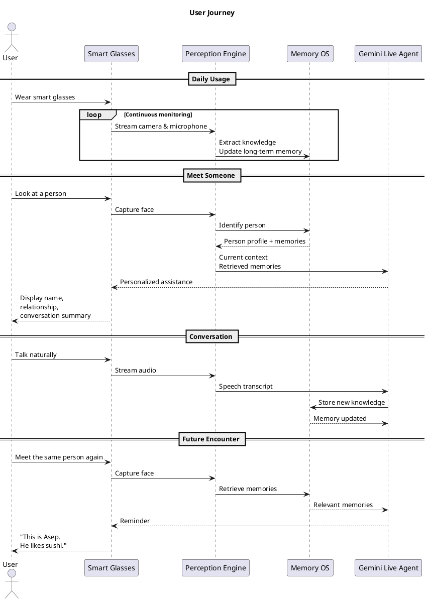

## Core Features & User Journey

Our Minimum Viable Product (MVP) focuses on one primary objective: **helping individuals with memory impairment maintain daily social interactions through an AI-powered wearable memory assistant**. Rather than functioning as a conventional chatbot, the system continuously observes the user's environment, builds structured long-term memories, and proactively retrieves relevant information when needed.

The MVP consists of six core features.

### 1. Continuous Multimodal Perception

The smart glasses continuously capture visual and audio information using an onboard camera and microphone. Sensor data is streamed to the cloud, where AI models perform face recognition, scene understanding, and speech transcription.

Instead of processing high-frame-rate video, the system intentionally samples approximately **1 frame per second**, which aligns with the practical capabilities of modern multimodal LLMs such as Gemini Live while significantly reducing computational cost and bandwidth.

**Output**

- Detected people
- Visual scene description
- Speech transcript
- Environmental observations

---

### 2. Face Recognition & Identity Management

Whenever a person appears in the camera view, the system attempts to identify them using facial embeddings generated by InsightFace and similarity search through FAISS.

If the person has been encountered previously, the system retrieves the corresponding identity. Otherwise, a temporary identity is created until the user introduces the person (e.g., "This is Asep"). The new identity is then permanently stored in the long-term memory system for future interactions.

**Output**

- Person identification
- Unknown person detection
- Identity registration
- Persistent person profiles

---

### 3. Automatic Memory Formation

Instead of storing raw conversations, the system continuously transforms observations into structured knowledge.

During conversations, AI extracts meaningful information such as names, occupations, family relationships, personal preferences, locations, upcoming events, reminders, and commitments. These observations are consolidated into long-term memories rather than preserving every spoken sentence.

For example:

> "Asep works as a software engineer and enjoys Japanese food."

is stored as structured semantic knowledge instead of raw dialogue.

**Output**

- Episodic memories
- Semantic memories
- Knowledge graph relationships
- Searchable memory records

---

### 4. Context-Aware Memory Retrieval

When the user asks a question or encounters a familiar person again, the system retrieves only the most relevant memories instead of loading the entire conversation history.

Retrieval considers multiple contextual signals, including:

- Visible people
- Current location
- Ongoing conversation
- Recent interactions
- Temporal relevance
- Semantic similarity

This enables efficient reasoning while avoiding unnecessary context overload.

**Output**

- Relevant memories
- Conversation history
- Person summaries
- Context-aware prompts

---

### 5. AI Memory Assistant

Gemini Live acts as the reasoning engine that combines current observations with retrieved memories to generate personalized assistance.

The assistant can answer questions such as:

- "Who is this?"
- "What is his favorite food?"
- "When did I last meet him?"
- "What were we discussing yesterday?"
- "Do I have any appointments this afternoon?"

Rather than relying solely on the LLM's internal knowledge, responses are grounded using the system's long-term memory.

**Output**

- Personalized responses
- Contextual reminders
- Social interaction assistance
- Memory recall support

---

### 6. Wearable User Interface

The smart glasses provide a lightweight, hands-free interface through a small OLED display.

Relevant information is presented proactively during conversations without requiring users to interact with a smartphone.

Example display information includes:

- Person's name
- Relationship
- Recent conversation topic
- Important reminders
- Upcoming events
- Device status

This allows the system to function as a discreet cognitive assistant during everyday social interactions.

---

## User Journey

```text
1. User wears the smart glasses.

        ↓

2. Camera and microphone continuously capture the surrounding environment.

        ↓

3. Sensor data is streamed to the cloud through LiveKit.

        ↓

4. AI identifies visible people, understands the scene, and transcribes speech.

        ↓

5. New observations are converted into structured long-term memories.

        ↓

6. When a familiar person is encountered again, the system retrieves relevant memories.

        ↓

7. Gemini Live reasons over the retrieved memories and current context.

        ↓

8. Personalized reminders and contextual information are displayed on the smart glasses.
```

---

## Minimum Viable Product Scope

The hackathon MVP focuses on validating the core concept rather than building a production-ready wearable platform.

The MVP includes:

- Continuous video and audio streaming from ESP32-S3 smart glasses
- Cloud-based multimodal perception
- Face recognition with automatic identity registration
- Long-term semantic and episodic memory storage
- Context-aware memory retrieval
- Gemini Live reasoning with tool calling
- OLED-based wearable interface
- Persistent memory across multiple interactions

The following features are intentionally excluded from the MVP:

- Mobile application
- Multi-device synchronization
- Offline AI inference
- Battery optimization
- OTA firmware updates
- Advanced privacy management
- Medical-grade diagnostic capabilities

By limiting the MVP to these essential capabilities, the project demonstrates the feasibility of a universal wearable memory assistant while remaining achievable within the five-day hackathon timeline.


