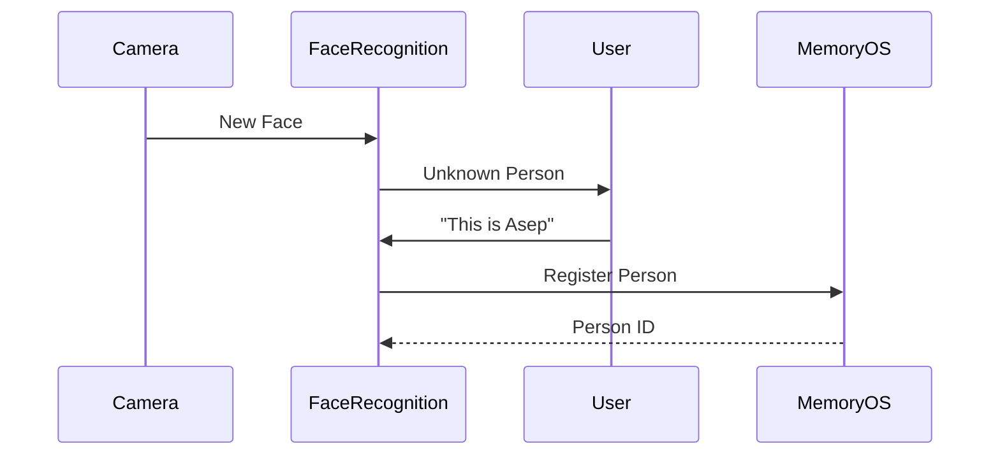

# Face Recognition PRD

**Version:** 1.0  
**Status:** Draft  
**Owner:** AI Vision Team

---

# 1. Overview

The Face Recognition module is responsible for detecting, identifying, and managing human identities observed by the wearable device.

Unlike traditional biometric authentication systems, this module is designed for persistent personal memory assistance. It continuously associates visual observations with long-term knowledge stored in the Memory OS.

The module determines whether a detected face belongs to an existing person or represents a new individual that should be registered.

---

# 2. Objectives

The Face Recognition module is designed to:

- Detect faces in incoming frames.
- Generate face embeddings.
- Identify previously known individuals.
- Detect unknown people.
- Support registration of new identities.
- Maintain stable identities across multiple encounters.
- Integrate with Memory OS.

---

# 3. High-Level Architecture

```mermaid
flowchart LR

Frame

↓

Face Detection

↓

Face Alignment

↓

Embedding Generation

↓

Face Retrieval

↓

Identity Resolution

↓

Memory OS
```

---

# 4. Responsibilities

The module is responsible for:

- Face detection
- Face alignment
- Embedding generation
- Similarity search
- Identity assignment
- Unknown face detection
- Identity confidence estimation

The module is **not responsible** for:

- Person biography
- Relationship reasoning
- Conversation memory
- Knowledge extraction

These responsibilities belong to higher-level services.

---

# 5. Processing Pipeline

```mermaid
flowchart TD

Frame

↓

Detect Face

↓

Align Face

↓

Generate Embedding

↓

Search FAISS

↓

Similarity Score

↓

Known?

Yes --> Existing Person

No --> Unknown Person
```

---

# 6. Face Detection

Incoming frames are processed by InsightFace to locate visible faces.

Responsibilities include:

- Face localization
- Bounding box estimation
- Landmark detection
- Multi-face detection

Output:

```yaml
faces:
  - bbox
  - landmarks
```

---

# 7. Face Alignment

Detected faces are normalized before feature extraction.

Alignment reduces variation caused by:

- Head rotation
- Camera angle
- Scale
- Minor facial pose differences

The aligned face is passed to the embedding model.

---

# 8. Face Embedding

Each aligned face is converted into a numerical embedding using InsightFace.

Example:

```yaml
embedding:

[0.23, -0.18, 0.52, ...]
```

Characteristics:

- Fixed-dimensional vector
- Identity-preserving
- Lighting invariant
- Pose tolerant

Embeddings are temporary unless associated with an identity.

---

# 9. Face Retrieval

Embeddings are compared against the FAISS index.

```mermaid
flowchart LR

Embedding

↓

FAISS Search

↓

Top-K Candidates

↓

Identity Resolution
```

Each search returns:

- Candidate IDs
- Similarity scores
- Confidence values

---

# 10. Identity Resolution

Identity assignment follows confidence thresholds.

Example:

| Similarity | Result         |
| ---------- | -------------- |
| >0.80      | Known person   |
| 0.60–0.80  | Possible match |
| <0.60      | Unknown person |

Threshold values are configurable.

---

# 11. Unknown Face Handling

If no reliable match is found, the face is classified as unknown.

The system creates a temporary identity.

Example:

```yaml
Unknown Person

↓

Temporary ID

↓

Conversation

↓

User confirms name

↓

Permanent Person
```

The temporary identity remains active during the current interaction.

---

# 12. Registration Workflow



---

# 13. Continuous Identity Tracking

Once identified, the module attempts to maintain identity consistency across consecutive frames.

Responsibilities include:

- Stable tracking
- Temporary occlusion handling
- Re-identification
- Duplicate prevention

This reduces repeated lookups during continuous conversations.

---

# 14. Integration with Memory OS

Each confirmed identity maps to a unique Person ID.

Example:

```yaml
Face Embedding

↓

Person ID

↓

Memory OS

↓

Person Profile

↓

Conversation History

↓

Preferences
```

The Face Recognition module never accesses storage directly.

All interactions occur through the Tool API.

---

# 15. Multiple Faces

The module supports simultaneous recognition of multiple individuals.

Each face maintains:

- Tracking ID
- Person ID
- Confidence
- Visibility state

The Context Engine determines which person is currently relevant.

---

# 16. Error Handling

Common scenarios include:

| Situation                   | Action            |
| --------------------------- | ----------------- |
| Face partially visible      | Retry             |
| Multiple similar identities | Return candidates |
| Low confidence              | Mark unknown      |
| Temporary occlusion         | Preserve tracking |
| Duplicate registration      | Merge identities  |

---

# 17. Performance Targets

| Metric              | Target  |
| ------------------- | ------- |
| Processing Rate     | ~1 FPS  |
| Max Faces per Frame | 5       |
| Embedding Time      | <100 ms |
| FAISS Search        | <20 ms  |
| Identity Assignment | <150 ms |

The module follows the overall system strategy of event-driven processing rather than high-frame-rate inference.

---

# 18. Future Extensions

Potential future capabilities include:

- Face quality assessment
- Age estimation
- Emotion recognition
- Gaze estimation
- Family relationship clustering
- Automatic identity merging
- Local embedding cache
- Privacy-preserving face encryption

---

# 19. Design Principles

The Face Recognition module follows several core principles.

- Identity is persistent.
- Recognition is probabilistic.
- Unknown people are first-class citizens.
- Embeddings are immutable.
- Person profiles live outside the recognition system.
- AI inference remains cloud-based.
- Recognition supports long-term memory assistance.
