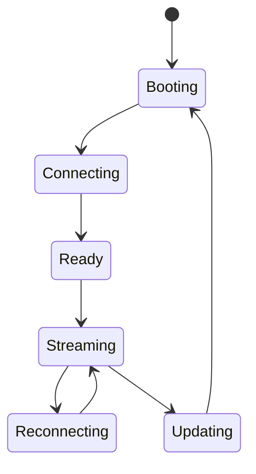
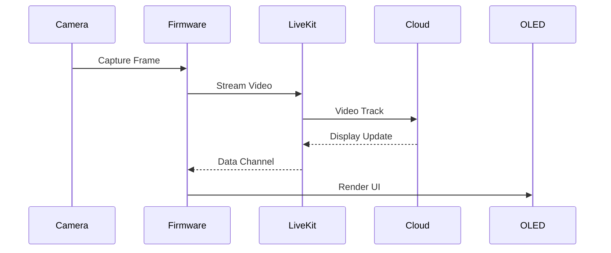

# Device Runtime (Firmware) PRD

**Version:** 1.0  
**Status:** Draft  
**Owner:** Embedded Systems Team

---

# 1. Overview

The Device Runtime is responsible for managing all on-device hardware components and maintaining reliable communication with the cloud infrastructure.

Unlike traditional smart devices, the Device Runtime performs **no artificial intelligence inference**. Its primary role is to continuously capture multimodal sensor data, stream it to the cloud, receive responses, and present them to the user.

The firmware is intentionally designed as a lightweight thin client to maximize battery life, simplify maintenance, and leverage cloud-based AI services.

---

# 2. Objectives

The Device Runtime is designed to:

- Manage camera operation.
- Capture microphone audio.
- Render information on the OLED display.
- Handle user input.
- Stream sensor data to the cloud.
- Receive AI responses.
- Manage device connectivity.
- Monitor battery and system health.

---

# 3. Architecture

```mermaid
flowchart LR

Boot

↓

SystemManager

↓

DeviceManager

↓

CameraService

AudioService

DisplayService

ButtonService

PowerManager

NetworkManager

↓

CommunicationManager

↓

Cloud
```

---

# 4. Responsibilities

The firmware is responsible only for:

- Hardware initialization.
- Sensor management.
- Data streaming.
- Network communication.
- Device state management.
- Display rendering.
- Power management.
- OTA updates (future).

The firmware is **not responsible** for:

- Face recognition.
- Scene understanding.
- Speech recognition.
- Memory management.
- Knowledge extraction.
- LLM reasoning.

These responsibilities belong exclusively to cloud services.

---

# 5. Boot Sequence

```mermaid
flowchart TD

PowerOn

↓

Initialize MCU

↓

Initialize Peripherals

↓

Connect WiFi

↓

Authenticate Device

↓

Connect LiveKit

↓

Start Services

↓

Ready
```

During startup, every subsystem performs a self-check before entering operational mode.

---

# 6. Camera Service

The Camera Service controls the OV3660 camera module.

Responsibilities include:

- Camera initialization.
- Frame capture.
- Resolution configuration.
- Exposure control.
- Buffer management.
- Frame delivery.

Typical configuration:

| Parameter   | Value               |
| ----------- | ------------------- |
| Resolution  | 640×480             |
| Sensor FPS  | ~30 FPS             |
| Stream Type | MJPEG               |
| AI Sampling | Controlled by Cloud |

The firmware continuously streams video.

Frame sampling occurs **only in the cloud**.

---

# 7. Audio Service

The Audio Service captures microphone input.

Responsibilities:

- Audio initialization.
- Audio buffering.
- Continuous streaming.
- Noise suppression (future).

Typical configuration:

| Parameter   | Value      |
| ----------- | ---------- |
| Sample Rate | 16 kHz     |
| Channels    | Mono       |
| Streaming   | Continuous |

Audio processing is performed by cloud services.

---

# 8. Display Service

The Display Service manages the OLED display.

Responsibilities include:

- Text rendering.
- Icons.
- Notification display.
- Brightness control.
- Display refresh.

Example screens:

- Person identified
- Reminder
- Current time
- Battery level
- WiFi status
- Listening indicator

The display never performs business logic.

It simply renders UI commands received from the cloud.

---

# 9. Button Service

The wearable contains one programmable input button.

Possible actions include:

| Action       | Description             |
| ------------ | ----------------------- |
| Single Press | Activate interaction    |
| Double Press | Register new memory     |
| Long Press   | Power options           |
| Triple Press | Emergency mode (future) |

Button events are transmitted to the cloud.

---

# 10. Network Manager

The Network Manager maintains WiFi connectivity.

Responsibilities:

- Initial connection.
- Automatic reconnection.
- Signal monitoring.
- Connection quality measurement.
- Retry strategy.

The device should automatically recover from temporary network failures.

---

# 11. Communication Manager

The Communication Manager is responsible for realtime communication with cloud services.

Responsibilities:

- Open LiveKit session.
- Video streaming.
- Audio streaming.
- Data channel messaging.
- Heartbeat.
- Packet buffering.
- Automatic reconnection.

Communication is encrypted using TLS.

---

# 12. Power Manager

The Power Manager monitors device health.

Responsibilities include:

- Battery monitoring.
- Charging detection.
- Voltage measurement.
- Sleep mode (future).
- Thermal monitoring (future).

Example telemetry:

```yaml
battery: 84%

charging: false

wifi_signal: -58 dBm

temperature: 39°C
```

---

# 13. Device State Machine



---

# 14. Communication Flow



---

# 15. Error Recovery

The firmware should gracefully recover from failures.

Examples include:

| Failure              | Recovery                       |
| -------------------- | ------------------------------ |
| WiFi disconnected    | Automatic reconnect            |
| LiveKit disconnected | Rejoin room                    |
| Camera unavailable   | Restart Camera Service         |
| OLED failure         | Continue streaming             |
| Low battery          | Notify user                    |
| Server unavailable   | Retry with exponential backoff |

The firmware should continue operating whenever possible.

---

# 16. Logging

The firmware records lightweight diagnostic logs.

Examples:

- Boot completed.
- WiFi connected.
- Camera initialized.
- LiveKit connected.
- Battery warning.
- Camera restart.

Logs are primarily intended for debugging during development.

---

# 17. Security

The firmware follows several security principles.

- Secure device authentication.
- TLS encrypted communication.
- No API keys stored in plaintext.
- Signed firmware updates (future).
- Secure OTA (future).

Sensitive user data is never permanently stored on the device.

---

# 18. Performance Targets

| Metric             | Target     |
| ------------------ | ---------- |
| Boot Time          | <10 s      |
| WiFi Reconnect     | <5 s       |
| LiveKit Reconnect  | <5 s       |
| Camera Stream      | Continuous |
| Audio Stream       | Continuous |
| OLED Refresh       | <100 ms    |
| Battery Monitoring | Every 30 s |

---

# 19. Future Extensions

Potential future improvements include:

- BLE provisioning
- OTA firmware updates
- Adaptive camera resolution
- Dynamic bitrate adjustment
- Local wake-word detection
- Low-power standby mode
- Multi-network support
- Edge buffering during connectivity loss

---

# 20. Design Principles

The Device Runtime follows several core principles.

- Thin client architecture.
- Cloud-first AI processing.
- Continuous multimodal streaming.
- Hardware abstraction.
- Fault-tolerant operation.
- Low power consumption.
- Modular service architecture.
- Secure communication.
