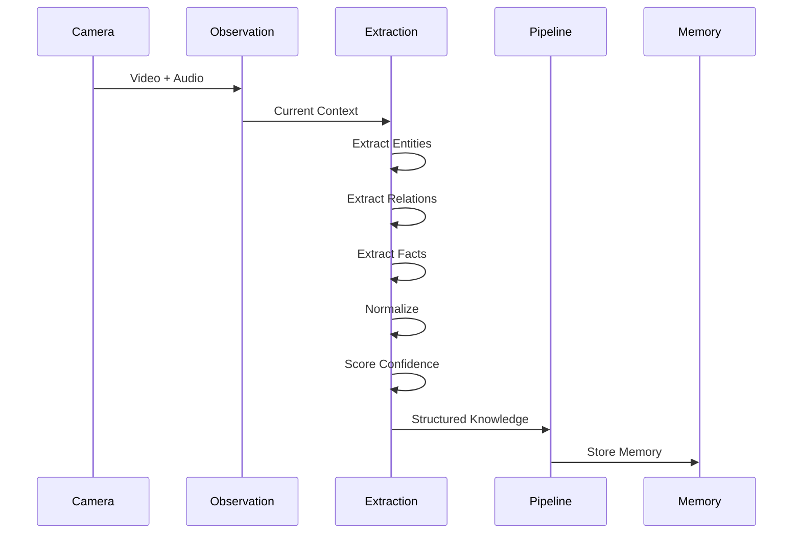

# Knowledge Extraction PRD

**Version:** 1.0  
**Status:** Draft  
**Owner:** AI Platform Team

---

# 1. Overview

The Knowledge Extraction Engine is responsible for transforming multimodal observations into structured knowledge that can be understood, validated, and stored by Memory OS.

Rather than storing raw conversations or images, the engine extracts meaningful entities, relationships, facts, preferences, and events from the user's daily experiences.

It acts as the semantic bridge between perception and long-term memory.

---

# 2. Objectives

The Knowledge Extraction Engine is designed to:

- Transform observations into structured knowledge.
- Extract entities from conversations and scenes.
- Identify relationships between entities.
- Detect user preferences.
- Recognize events and activities.
- Produce explainable facts.
- Generate confidence scores.
- Minimize redundant memories.

---

# 3. Position in Architecture

```mermaid
flowchart LR

ObservationEngine

↓

WorkingMemory

↓

KnowledgeExtraction

↓

MemoryPipeline

↓

MemoryOS
```

---

# 4. Processing Pipeline


---

# 5. Input

The Knowledge Extraction Engine consumes **CurrentContext** produced by the Observation Engine.

Example:

```yaml
timestamp: 2026-08-06

visible_people:

- Asep

scene:

Coffee Shop

speech:

"I work at Tokopedia and my favorite food is sushi."

objects:

Laptop

Coffee
```

---

# 6. Entity Extraction

The first stage identifies real-world entities.

Supported entity types include:

| Entity       | Example            |
| ------------ | ------------------ |
| Person       | Asep               |
| Organization | Tokopedia          |
| Place        | Bandung            |
| Object       | Laptop             |
| Food         | Sushi              |
| Event        | Team Meeting       |
| Reminder     | Doctor Appointment |

Output

```yaml
entities:
  - Person: Asep

  - Organization: Tokopedia

  - Food: Sushi
```

---

# 7. Relationship Extraction

Relationships connect entities together.

Example

Input

```
Asep works at Tokopedia.
```

Output

```text
(Asep)

↓

WORKS_AT

↓

(Tokopedia)
```

Supported relationships

- WORKS_AT
- LIVES_IN
- LIKES
- DISLIKES
- FRIEND_OF
- FAMILY_OF
- ATTENDS
- LOCATED_AT
- OWNS
- HAS_EVENT

---

# 8. Fact Extraction

Facts represent objective knowledge.

Example

Conversation

```
I live in Bandung.
```

↓

Fact

```yaml
subject:

Asep

predicate:

Lives In

object:

Bandung
```

Facts become Semantic Memory.

---

# 9. Preference Extraction

The engine detects personal preferences.

Examples

```
I love sushi.
```

↓

```
LIKES

↓

Sushi
```

---

```
I hate coffee.
```

↓

```
DISLIKES

↓

Coffee
```

Preference strength is estimated using linguistic cues.

---

# 10. Event Extraction

The engine identifies events from conversations.

Example

```
Let's meet tomorrow at 2 PM.
```

↓

```yaml
Event:

Meeting

Date:

Tomorrow

Time:

2 PM
```

Events are forwarded to the Reminder System.

---

# 11. Normalization

Extracted knowledge is converted into canonical forms.

Examples

```
UI

↓

Universitas Indonesia
```

---

```
IBM

↓

International Business Machines
```

---

```
Jakarta

↓

DKI Jakarta
```

Normalization reduces duplicate knowledge.

---

# 12. Confidence Scoring

Each extracted fact receives a confidence score.

Signals include:

| Signal                | Description           |
| --------------------- | --------------------- |
| LLM confidence        | Extraction certainty  |
| Face recognition      | Person confidence     |
| Repeated observations | Memory consistency    |
| Temporal consistency  | Stable over time      |
| User confirmation     | Explicit confirmation |

Example

```yaml
Fact:

Asep likes sushi

Confidence:

0.94
```

---

# 13. Structured Knowledge

The final output is independent of any storage engine.

Example

```yaml
knowledge:

entity:

Person

name:

Asep

relationships:

- WORKS_AT: Tokopedia

- LIKES: Sushi

facts:

occupation:

Software Engineer

confidence:

0.95

source:

Conversation #152

timestamp:

2026-08-06
```

This output is forwarded to Memory Pipeline.

---

# 14. Explainability

Every extracted knowledge object contains provenance metadata.

Each knowledge item stores:

- Source observation
- Conversation ID
- Timestamp
- Confidence
- Related entities
- Extraction version

This allows every memory to be traced back to its original source.

---

# 15. Failure Handling

If extraction confidence is low:

- Mark knowledge as uncertain.

If entity resolution fails:

- Create a temporary entity.

If speech recognition fails:

- Continue using visual observations.

If no meaningful knowledge is detected:

- Do not generate memory.

---

# 16. Example Workflow



---

# 17. Future Extensions

Potential future capabilities include:

- Emotion extraction
- Personality trait extraction
- Habit detection
- Daily routine learning
- Multi-language extraction
- Health-related knowledge extraction
- Financial behavior extraction
- Document understanding
- OCR knowledge extraction
- Image-based memory extraction

---

# 18. Design Principles

The Knowledge Extraction Engine follows several core principles.

- Facts over transcripts.
- Structured knowledge over raw text.
- Storage-independent output.
- Explainable extraction.
- Confidence-aware processing.
- Multimodal by design.
- Incremental knowledge creation.
- LLM-assisted but not LLM-dependent.
