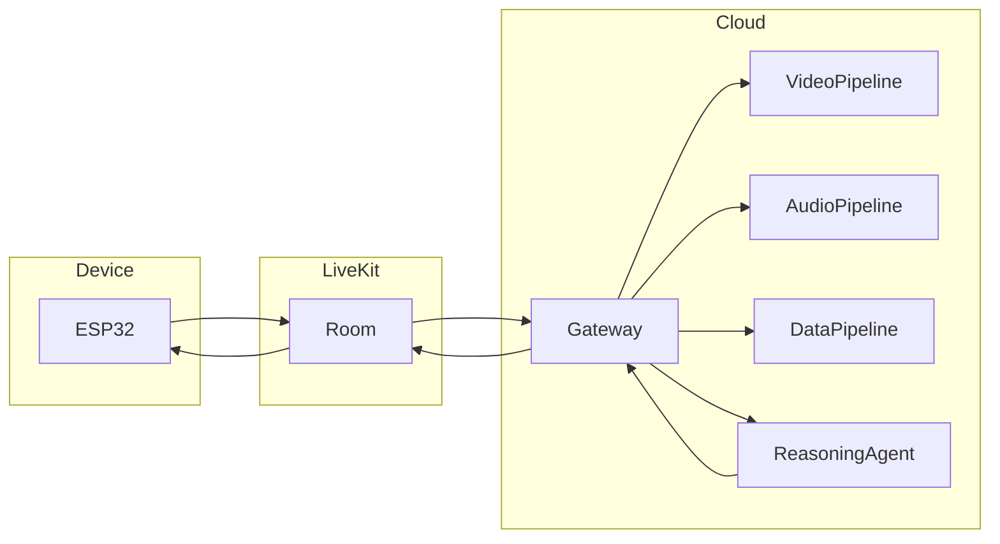
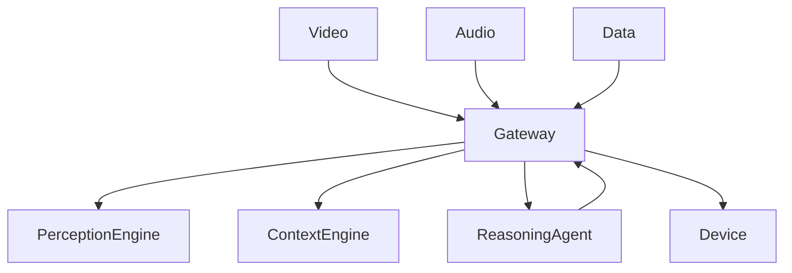
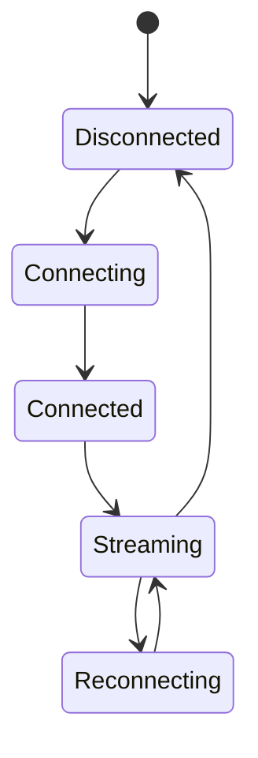

# LiveKit Transport PRD

**Version:** 1.0  
**Status:** Draft  
**Owner:** Platform Team

---

# 1. Overview

The LiveKit Transport Layer provides secure, low-latency, bidirectional communication between the wearable device and cloud services.

It acts purely as a communication layer and contains no business logic or AI inference.

The transport layer carries three independent data streams:

- Video
- Audio
- Device Data

Cloud services subscribe to these streams and publish responses back to the device.

---

# 2. Objectives

The LiveKit Transport Layer is designed to:

- Stream camera video.
- Stream microphone audio.
- Synchronize device events.
- Deliver AI responses.
- Maintain persistent realtime sessions.
- Recover automatically from network failures.

---

# 3. High-Level Architecture



---

# 4. Communication Model

The system uses three independent communication channels.

| Channel      | Direction      | Purpose                         |
| ------------ | -------------- | ------------------------------- |
| Video Track  | Device → Cloud | Camera stream                   |
| Audio Track  | Device → Cloud | Microphone stream               |
| Data Channel | Bidirectional  | Commands, UI updates, telemetry |

Each channel operates independently.

Failure of one channel should not interrupt the others.

---

# 5. Video Transport

The wearable continuously streams video captured by the OV2640 camera.

Responsibilities include:

- Continuous streaming
- Frame delivery
- Timestamp synchronization

The transport layer **does not perform frame sampling**.

Frame sampling (~1 FPS) is handled by the Perception Engine in the cloud.

Typical configuration:

| Parameter  | Value      |
| ---------- | ---------- |
| Resolution | 640×480    |
| Stream     | Continuous |
| Sampling   | Cloud-side |

---

# 6. Audio Transport

Audio is streamed continuously to the cloud.

Responsibilities include:

- Microphone streaming
- Timestamp synchronization
- Audio packet delivery

Speech recognition is performed entirely in cloud services.

---

# 7. Data Channel

The Data Channel carries lightweight structured messages.

Examples include:

## Device → Cloud

- Battery status
- Button events
- Device telemetry
- Firmware version

Example

```json
{
  "type": "battery",
  "level": 82
}
```

---

## Cloud → Device

- OLED updates
- Interaction state
- Notifications
- Configuration updates

Example

```json
{
  "type": "display",
  "text": "Asep"
}
```

---

# 8. Gateway

The Gateway is the single entry point for all LiveKit traffic.

Responsibilities include:

- Session authentication
- Track subscription
- Message routing
- Stream synchronization
- Connection monitoring

The Gateway contains no AI logic.

It simply forwards streams to the appropriate services.

---

# 9. Stream Routing



---

# 10. Session Lifecycle



---

# 11. Reconnection Strategy

The transport layer automatically attempts reconnection when connectivity is lost.

Recovery includes:

- WiFi interruption
- LiveKit room disconnect
- Temporary cloud outage

The device should resume streaming without requiring user intervention.

---

# 12. Synchronization

All transmitted data includes timestamps.

This enables cloud services to synchronize:

- Video
- Audio
- Device events

before entering the Perception Engine.

Example

```yaml
timestamp:

2026-08-06T14:30:02.115

type:

video
```

---

# 13. Security

The transport layer follows several security principles.

- TLS encrypted communication
- Authenticated LiveKit sessions
- Short-lived access tokens
- Device identity verification

Sensitive application logic is never exposed to the wearable device.

---

# 14. Performance Targets

| Metric                | Target     |
| --------------------- | ---------- |
| Session Establishment | <5 s       |
| Automatic Reconnect   | <5 s       |
| Video Stream          | Continuous |
| Audio Stream          | Continuous |
| Data Channel Latency  | <200 ms    |
| Packet Loss Recovery  | Automatic  |

---

# 15. Failure Handling

If one transport channel fails, the remaining channels continue operating.

Examples:

| Failure                   | Recovery            |
| ------------------------- | ------------------- |
| Video interrupted         | Retry video track   |
| Audio interrupted         | Retry audio track   |
| Data channel disconnected | Reopen data channel |
| Session timeout           | Reconnect room      |

The transport layer is designed to degrade gracefully.

---

# 16. Future Extensions

Potential future capabilities include:

- Adaptive video bitrate
- Dynamic resolution scaling
- BLE fallback transport
- Multiple wearable devices
- Screen sharing
- Remote diagnostics
- OTA update transport
- Multi-room synchronization

---

# 17. Design Principles

The LiveKit Transport Layer follows several core principles.

- Transport only.
- No AI inference.
- No business logic.
- Independent communication channels.
- Fault-tolerant connections.
- Secure realtime communication.
- Cloud-first architecture.
