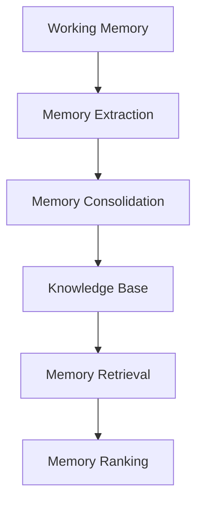
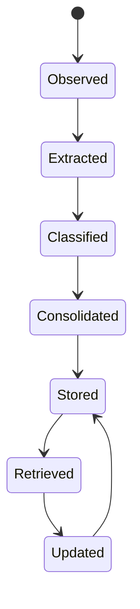
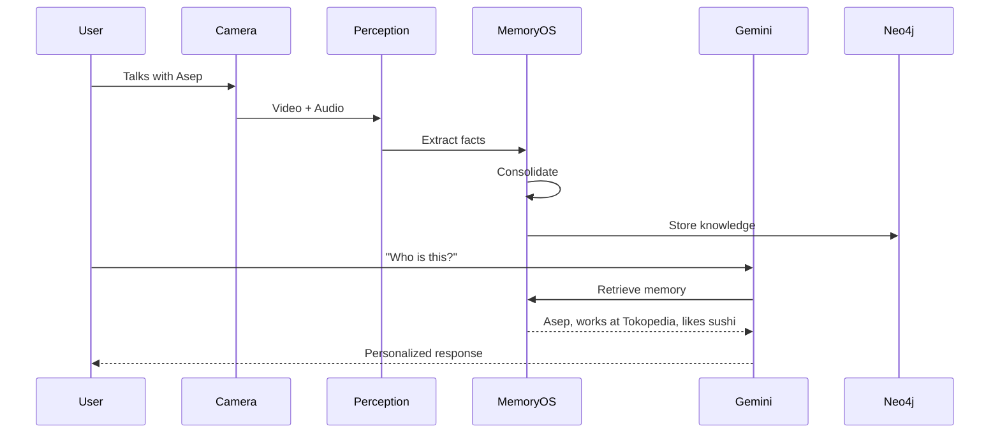

# Memory OS PRD

**Version:** 1.0  
**Status:** Draft  
**Owner:** AI Platform Team

---

# 1. Overview

Memory OS is the persistent cognitive layer of the system.

Instead of treating every interaction as an isolated conversation, Memory OS continuously observes, understands, stores, organizes, retrieves, and updates knowledge acquired throughout the user's daily life.

The objective is to provide the AI with a continuously evolving memory that resembles human long-term memory while remaining explainable, searchable, and editable.

Memory OS is independent of any specific Large Language Model (LLM). Gemini Live acts only as the reasoning engine, while Memory OS remains the source of persistent knowledge.

---

# 2. Design Goals

Memory OS is designed with the following objectives:

- Continuously learn from daily experiences
- Remember people across multiple interactions
- Preserve important conversations
- Extract factual knowledge automatically
- Organize memories into meaningful relationships
- Retrieve only relevant memories
- Support continual updates over time
- Minimize hallucinations through structured memory
- Allow memories to be edited and corrected
- Scale to years of accumulated knowledge

---

# 3. High-Level Architecture

```mermaid
flowchart LR

Experience

↓

Perception

↓

Working Memory

↓

Memory Pipeline

↓

Memory OS

↓

Retrieval

↓

Reasoning

↓

Response
```

---

# 4. Core Components

Memory OS consists of six major components.



---

# 5. Working Memory

## Purpose

Working Memory represents the user's current context.

Unlike persistent memory, Working Memory exists only during the active interaction.

It contains:

- Visible people
- Current conversation
- Recent observations
- Current location
- Current task
- Active reminders

Working Memory is continuously updated by the Perception Layer.

---

# 6. Memory Extraction

## Purpose

Not every sentence should become a memory.

Memory Extraction identifies meaningful information from multimodal experiences.

Input sources include:

- Speech transcript
- Face recognition
- Scene understanding
- User interactions

Example

Conversation:

> "Hi, I'm Asep. I work at Tokopedia and I love sushi."

Extracted knowledge:

```text
Person

Asep

Occupation

Tokopedia

Preference

Sushi
```

Only meaningful facts continue to the next stage.

---

# 7. Memory Consolidation

## Purpose

Consolidation prevents duplicated memories.

Instead of inserting new knowledge every time, the system compares incoming facts with existing knowledge.

Possible outcomes include:

### Create

No similar memory exists.

↓

Insert new knowledge.

---

### Update

Knowledge already exists but has changed.

↓

Update existing memory.

---

### Merge

Two memories refer to the same entity.

↓

Combine both memories.

---

### Ignore

Information is duplicated.

↓

Discard.

---

### Conflict

Conflicting information is detected.

↓

Lower confidence score and request future confirmation.

---

# 8. Knowledge Base

The Knowledge Base represents long-term memory.

Unlike traditional chat history, knowledge is stored as entities and relationships.

Example

```text
Person

↓

WORKS_AT

↓

Tokopedia

↓

LOCATED_IN

↓

Jakarta
```

Knowledge categories include:

- People
- Organizations
- Places
- Preferences
- Events
- Relationships
- Objects
- Routines
- Medical information
- Personal history

---

# 9. Memory Retrieval

Memory Retrieval identifies which memories are relevant to the current context.

Retrieval combines multiple signals.

## Semantic relevance

Related concepts.

## Temporal relevance

Recent events.

## Spatial relevance

Current location.

## Social relevance

Current people nearby.

## Conversational relevance

Current discussion topic.

Only highly relevant memories are forwarded to the LLM.

---

# 10. Memory Ranking

When multiple memories are available, Memory Ranking prioritizes them.

Example scoring:

| Feature             | Weight |
| ------------------- | ------ |
| Semantic similarity | High   |
| Recent interaction  | High   |
| User importance     | High   |
| Frequency           | Medium |
| Confidence          | Medium |
| Age                 | Low    |

The ranking algorithm reduces prompt size while maximizing useful information.

---

# 11. Memory Lifecycle



---

# 12. Memory Types

Memory OS distinguishes several memory categories.

## Working Memory

Temporary runtime context.

---

## Episodic Memory

Chronological experiences.

Example:

> Yesterday I had lunch with Asep.

---

## Semantic Memory

Facts.

Example:

> Asep likes sushi.

---

## Procedural Memory (Future)

Personal routines.

Example:

> Every morning take medicine.

---

## Preference Memory

User preferences.

Example:

Favorite coffee.

Favorite restaurant.

Preferred doctor.

---

# 13. Knowledge Update Strategy

Knowledge evolves over time.

Example:

```text
2026

Company

Tokopedia
```

↓

```text
2027

Company

Google
```

Instead of deleting history, Memory OS stores temporal validity.

Old knowledge becomes historical rather than lost.

---

# 14. Forgetting Strategy

Not all memories should persist forever.

Memory OS periodically evaluates memories based on:

- Importance
- Frequency
- Recency
- User interaction

Possible actions:

- Keep
- Archive
- Compress
- Delete

Critical memories are never removed.

---

# 15. Explainability

Every stored memory contains provenance.

Each memory records:

- Source conversation
- Timestamp
- Confidence
- Related people
- Related observations

This allows every answer generated by the AI to be traced back to its origin.

---

# 16. Example Workflow



---

# 17. Future Extensions

Planned capabilities include:

- Memory confidence learning
- Emotional memory
- Image memory
- Document memory
- Voiceprint recognition
- Personalized forgetting
- Cross-device synchronization
- Caregiver shared memory
- Memory timeline visualization
- Autonomous memory summarization

---

# 18. Design Principles

Memory OS follows several guiding principles.

## Persistent

Knowledge survives across sessions.

---

## Explainable

Every memory has an identifiable origin.

---

## Modular

Independent of any LLM provider.

---

## Retrieval-first

Only relevant memories are sent to the reasoning engine.

---

## Human-inspired

Inspired by cognitive concepts such as working memory, episodic memory, semantic memory, and memory consolidation rather than simple conversation history.

---

## Scalable

Designed to support years of accumulated multimodal experiences without requiring complete retraining or rebuilding of the knowledge base.
