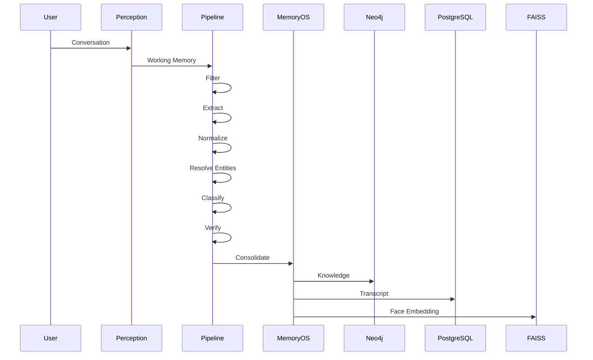

# Memory Pipeline PRD

**Version:** 1.0  
**Status:** Draft  
**Owner:** AI Platform Team

---

# 1. Overview

The Memory Pipeline is responsible for transforming raw multimodal experiences into structured long-term knowledge.

Rather than storing every observation or conversation, the pipeline continuously filters, extracts, validates, organizes, and consolidates information before it becomes part of Memory OS.

The pipeline acts as the bridge between perception and persistent memory.

---

# 2. Objectives

The Memory Pipeline is designed to:

- Convert raw experiences into structured knowledge.
- Reduce unnecessary storage.
- Prevent duplicated memories.
- Preserve historical information.
- Continuously update existing knowledge.
- Improve retrieval quality.
- Support lifelong learning.

---

# 3. Pipeline Architecture


---

# 4. Stage 1 — Experience Filter

## Purpose

Not every observation should become memory.

The Experience Filter removes information that is unlikely to provide future value.

Examples of discarded information:

- Background conversations
- Random pedestrians
- Temporary objects
- Noise
- Repeated observations

Examples of retained information:

- New people
- Important conversations
- Calendar information
- Preferences
- User requests
- Tasks
- Medical information

Output:

Structured experience candidates.

---

# 5. Stage 2 — Knowledge Extraction

The extraction stage converts multimodal information into structured facts.

Input sources include:

- Speech transcript
- Face recognition
- Scene understanding
- OCR
- User interactions

Example

Input

> "Hi, I'm Asep. I work at Tokopedia and my favorite food is sushi."

Output

```yaml
Person:
  name: Asep

Occupation: Tokopedia

Preference: Sushi
```

---

# 6. Stage 3 — Knowledge Normalization

Different expressions often represent the same meaning.

Examples

```
IBM

↓

International Business Machines
```

```
Jakarta

↓

DKI Jakarta
```

```
UI

↓

Universitas Indonesia
```

The normalization stage converts extracted knowledge into canonical representations.

---

# 7. Stage 4 — Entity Resolution

Multiple observations may refer to the same real-world entity.

Example

Conversation 1

```
Asep
```

Conversation 2

```
Muhammad Asep
```

Conversation 3

```
Bang Asep
```

Entity Resolution determines whether these references represent the same individual.

If confidence is sufficiently high, the memories are merged.

Otherwise, they remain separate until future evidence is available.

---

# 8. Stage 5 — Memory Classification

Knowledge is categorized according to semantic type.

Examples

| Category      | Example             |
| ------------- | ------------------- |
| Person        | Asep                |
| Place         | Bandung             |
| Event         | Team Meeting        |
| Preference    | Sushi               |
| Relationship  | Brother             |
| Organization  | Tokopedia           |
| Reminder      | Dentist Appointment |
| Shopping Item | Milk                |

Classification enables efficient retrieval and reasoning.

---

# 9. Stage 6 — Memory Verification

Before becoming long-term memory, extracted knowledge is validated.

Verification evaluates:

- Confidence score
- Source reliability
- Repeated observations
- Contradictory information

Possible outcomes

- Accept
- Reject
- Require confirmation
- Lower confidence

Example

```
"I think my favorite food is sushi."

↓

Confidence = Medium
```

```
"I always eat sushi."

↓

Confidence = High
```

---

# 10. Stage 7 — Memory Consolidation

Consolidation integrates new knowledge into Memory OS.

Possible actions

## Create

New knowledge.

↓

Insert.

---

## Update

Existing knowledge changed.

↓

Replace current value while preserving history.

---

## Merge

Duplicate entities detected.

↓

Merge.

---

## Archive

Information no longer active.

↓

Move to historical knowledge.

---

## Conflict

Contradictory information detected.

↓

Store both versions with confidence scores.

---

# 11. Persistent Storage

After consolidation, information is distributed to specialized storage systems.

```mermaid
flowchart LR

Knowledge

↓

Consolidation

↓

Neo4j

Knowledge

↓

PostgreSQL

Face

↓

FAISS
```

Neo4j stores semantic relationships.

PostgreSQL stores operational records and transcripts.

FAISS stores facial embeddings.

---

# 12. Confidence Model

Each knowledge item receives a confidence score.

Factors include:

- Number of observations
- Source reliability
- User confirmation
- Time consistency
- Face recognition confidence

Example

```
Asep likes sushi

Confidence

96%
```

---

# 13. Temporal Knowledge

Knowledge changes over time.

Instead of overwriting previous values, Memory Pipeline preserves historical validity.

Example

```
2026

Company

Tokopedia
```

↓

```
2028

Company

OpenAI
```

Historical records remain available.

---

# 14. Duplicate Detection

Duplicate detection combines several signals.

- Face similarity
- Name similarity
- Phone number
- Organization
- Relationship graph
- Conversation context

Multiple weak signals may produce one strong match.

---

# 15. Conflict Resolution

Contradictory information is expected.

Example

```
Lives in Bandung
```

Later

```
Lives in Jakarta
```

Instead of deleting one value, the system records temporal changes and updates the active record while preserving historical information.

---

# 16. Retrieval Metadata

Every stored memory includes metadata.

```yaml
Memory ID

Created At

Updated At

Confidence

Importance

Source

Related Entities

Related Conversations

Version
```

This metadata improves explainability and ranking.

---

# 17. Example End-to-End Flow



---

# 18. Future Extensions

Future improvements include:

- Importance prediction model
- Personalized memory scoring
- Emotion-aware memories
- Image-based memories
- Voiceprint memories
- Automatic summarization
- Active memory rehearsal
- Memory decay modeling
- Human feedback learning
- Multi-user shared memories

---

# 19. Design Principles

The Memory Pipeline follows several core principles.

- Experience-first rather than transcript-first.
- Facts over raw conversations.
- Human-inspired memory formation.
- Incremental lifelong learning.
- Explainable transformations.
- Storage-independent architecture.
- Retrieval-oriented optimization.
- Continuous knowledge refinement.
