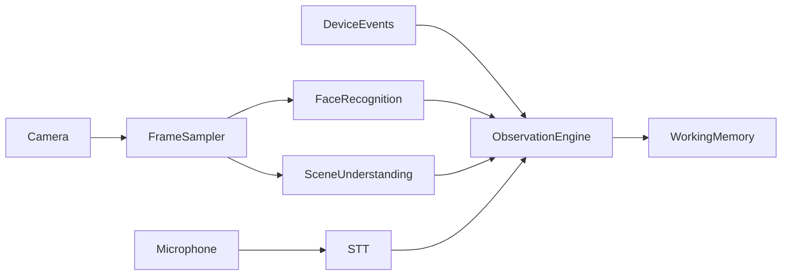
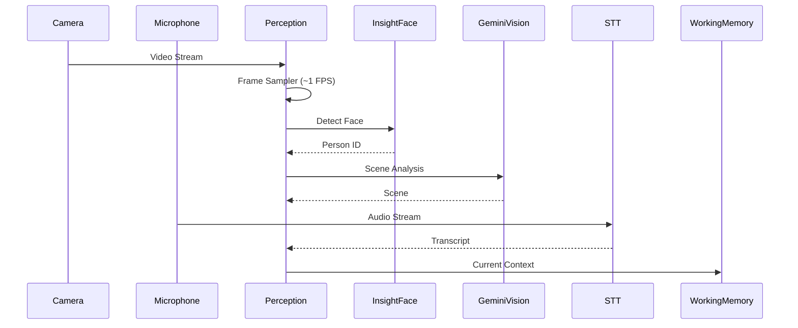

# Perception Engine PRD

**Version:** 1.0  
**Status:** Draft  
**Owner:** AI Platform Team

---

# 1. Overview

The Perception Engine is responsible for transforming raw multimodal sensor data into structured observations that can be consumed by Memory OS.

Unlike the reasoning layer, the Perception Engine does not make decisions or generate responses. Its only responsibility is to understand the user's current environment.

The engine continuously processes video, audio, and device signals to maintain an up-to-date representation of the user's current situation.

---

# 2. Objectives

The Perception Engine is designed to:

- Continuously observe the environment.
- Detect people and recognize known faces.
- Identify previously unseen individuals.
- Understand the surrounding scene.
- Convert speech into text.
- Build a unified representation of the current context.
- Feed Working Memory with structured observations.

---

# 3. High-Level Architecture



---

# 4. Processing Strategy

Unlike real-time navigation systems, the proposed solution focuses on memory augmentation rather than immediate environmental awareness.

The camera continuously streams video through LiveKit.

Instead of processing every frame, a **Frame Sampler** periodically selects approximately **one frame per second (~1 FPS)** for AI inference.

```
Camera (≈30 FPS)

↓

LiveKit Video Stream

↓

Frame Sampler (~1 FPS)

↓

Perception Pipeline
```

This design dramatically reduces:

- Cloud inference cost
- GPU utilization
- Network bandwidth
- API requests

while remaining sufficient for memory-oriented tasks such as recognizing people, understanding conversations, and recording daily experiences.

---

# 5. Input Sources

## Camera

Provides continuous visual observations.

Examples:

- Faces
- Objects
- Environment
- Documents
- Activities

---

## Microphone

Captures user conversations.

Used for:

- Speech recognition
- Speaker interactions
- Conversation history

---

## Device Events

Examples:

- Button press
- Battery status
- Connection state
- Timestamp

---

# 6. Frame Sampler

## Purpose

Reduce unnecessary visual processing.

Instead of analyzing every video frame, the sampler periodically forwards representative frames for perception.

Typical configuration:

| Parameter         | Value       |
| ----------------- | ----------- |
| Camera FPS        | ~30 FPS     |
| AI Processing FPS | ~1 FPS      |
| Sampling Strategy | Periodic    |
| Adaptive Sampling | Future Work |

---

# 7. Face Recognition

## Library

InsightFace

## Responsibilities

- Face Detection
- Face Alignment
- Face Embedding
- Face Matching

Each detected face produces an embedding vector.

The embedding is queried against the FAISS index.

Possible outcomes:

- Known person
- Unknown person

If no match exceeds the similarity threshold, the face is marked as a new individual.

---

# 8. Face Retrieval

The generated face embedding is searched against the FAISS index.

Result:

```text
Face

↓

FAISS

↓

Top-k Candidates

↓

Best Match

↓

Person ID
```

If confidence is below threshold:

```
Unknown Person
```

The Memory Pipeline may later register this individual.

---

# 9. Scene Understanding

## Library

Gemini Vision

The Scene Understanding module extracts high-level information from sampled frames.

Examples include:

- Current location
- Nearby objects
- User activity
- Visible text (OCR)
- Environmental context

Example output:

```yaml
Location:
Coffee Shop

Objects:
Laptop
Coffee
Notebook

Activity:
Meeting
```

Only semantic observations are returned.

Raw images are not permanently stored.

---

# 10. Speech Recognition

Speech recognition converts spoken language into text.

Possible implementations:

- Gemini Live
- Google Speech-to-Text
- Whisper

Outputs include:

- Transcript
- Timestamp
- Speaker confidence (future)

---

# 11. Observation Engine (replacing Perception Orchestrator)

## Purpose

The Observation Engine is responsible for combining outputs from all perception modules into a single coherent representation of the user's current environment.

Rather than allowing individual perception modules to modify Working Memory directly, every module produces standardized observations.

The Observation Engine synchronizes, validates, timestamps, and merges these observations before publishing them to Working Memory.

This separation keeps perception modules independent while ensuring downstream components receive a consistent world representation.

---

## Inputs

The Observation Engine receives structured observations from multiple perception modules.

| Source              | Observation       |
| ------------------- | ----------------- |
| Face Recognition    | FaceObservation   |
| Scene Understanding | SceneObservation  |
| Speech Recognition  | SpeechObservation |
| Device Events       | DeviceObservation |

---

## Observation Schema

Each perception module produces observations using a common structure.

```yaml
observation_id: uuid
timestamp: 2026-08-06T15:23:11
source: face_recognition
confidence: 0.97
payload: ...
```

This unified schema simplifies future integration of additional perception modules.

---

## Observation Types

### FaceObservation

```yaml
person_id: 15
name: Asep
confidence: 0.96
bounding_box: ...
embedding_id: 872
```

### SceneObservation

```yaml
location: Coffee Shop
objects:
  - Laptop
  - Coffee
  - Notebook
activity: Meeting
```

### SpeechObservation

```yaml
speaker: Unknown
transcript: "I like sushi."
language: English
```

### DeviceObservation

```yaml
battery: 81%
button: pressed
wifi: connected
```

---

## Observation Fusion

Multiple observations occurring within a short time window are merged into one **Current Context**.

Example:

```text
Face:  Asep
Scene: Coffee Shop
Speech: "I like sushi."
        ↓
Unified Context
```

```yaml
visible_person: Asep
location: Coffee Shop
conversation: "I like sushi."
time: "15:30"
```

Only this fused context is written into Working Memory.

---

## Synchronization Window

Because perception modules complete at different times, observations are synchronized using a temporal window.

Example configuration:

| Parameter           | Value      |
| ------------------- | ---------- |
| Fusion Window       | 1 second   |
| Observation TTL     | 5 seconds  |
| Maximum Context Age | 30 seconds |

This prevents inconsistent contexts caused by asynchronous inference.

---

## Confidence Aggregation

The Observation Engine computes confidence scores for the final context.

Example:

```text
Face Recognition:     0.97
Scene Understanding:  0.88
Speech Recognition:   0.95
        ↓
Current Context Confidence: 0.93
```

Confidence scores are propagated downstream to the Memory Pipeline.

---

## Output

The Observation Engine publishes a single standardized **CurrentContext** object.

```yaml
timestamp: 2026-08-06T15:30
visible_people:
  - Asep
scene: Coffee Shop
activity: Meeting
speech: "I like sushi."
device: "Battery 81%"
confidence: 0.94
```

Working Memory stores this object until it is replaced by a newer context.

---

## Why This Design Is Better

This change provides several significant architectural advantages:

- **Perception modules become stateless**, making them easy to test and replace without affecting other components.
- **Working Memory has a single write path**, through the Observation Engine. This avoids race conditions when Face Recognition, STT, and Vision complete at different times.
- **Adding new sensors becomes easy**. For example, to add GPS, IMU, accelerometer, or heart rate sensors later, simply create a `GPSObservation` or `HeartRateObservation` without modifying the Memory Pipeline or Context Engine.
- **Data format stays consistent** because all modules produce observation objects with the same schema.
- **Debugging is simpler**, since the entire observation stream can be recorded before fusion and inspected to see how `CurrentContext` is formed.

This design closely matches the architecture of modern robotics and AI agent systems, where almost no module directly modifies global state. They produce **observations** first, then a **fusion layer** unifies them. The Observation Engine serves as the integration hub that stays relevant as new sensors are added.

---

# 12. Working Memory Interface

The final perception output is written into Working Memory.

Example:

```yaml
CurrentContext

Visible People

Current Scene

Current Conversation

Current Activity

Current Time
```

Working Memory always reflects the most recent understanding of the environment.

---

# 13. Failure Handling

If one perception module fails, the remaining modules continue operating.

Examples:

- Face recognition unavailable → continue with scene understanding.
- Speech unavailable → continue with visual perception.
- Vision unavailable → continue with audio context.

The system is designed to degrade gracefully rather than stop functioning.

---

# 14. Example Workflow



---

# 15. Future Extensions

Potential future capabilities include:

- Emotion recognition
- Gaze estimation
- Hand gesture recognition
- Body pose estimation
- Speaker diarization
- Voiceprint identification
- Object tracking
- Adaptive frame sampling
- Multi-camera support
- On-device face detection

---

# 16. Design Principles

The Perception Engine follows several core principles.

- Observe before reasoning.
- Multimodal by design.
- Event-driven processing.
- Efficient cloud inference (~1 FPS).
- Modular perception components.
- Graceful degradation.
- LLM-independent architecture.
- Structured outputs for downstream memory processing.
