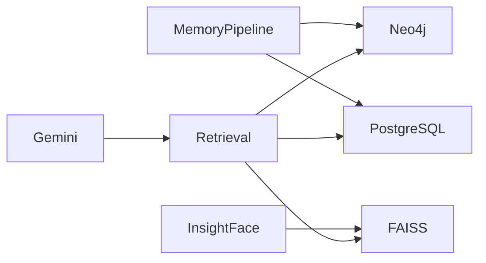
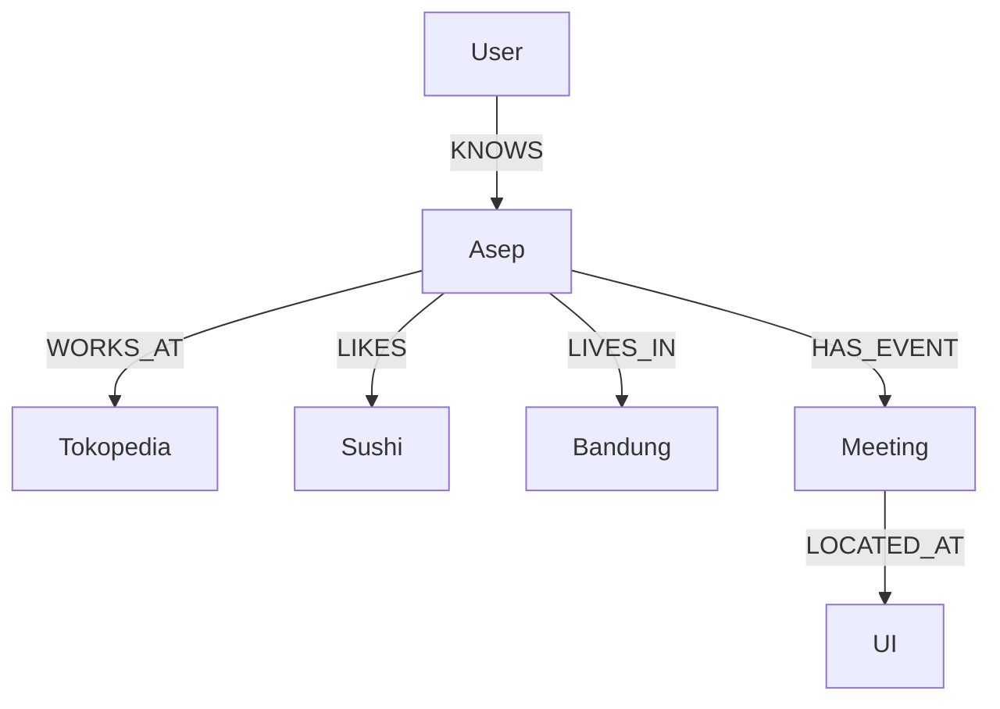
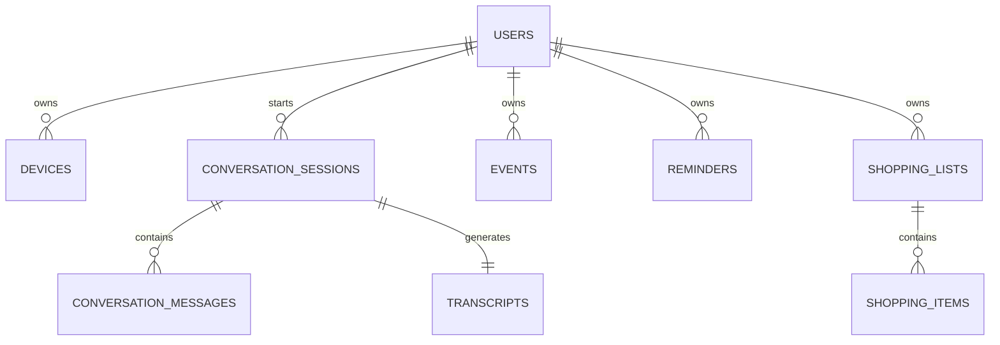

# Persistent Storage Layer PRD

**Version:** 1.0  
**Status:** Draft  
**Owner:** AI Platform Team

---

# 1. Overview

The Persistent Storage Layer is responsible for storing all long-term information generated by the Memory OS.

Unlike traditional chatbot architectures that rely primarily on conversation history, this system separates persistent storage into three specialized databases, each optimized for a different type of information.

| Database   | Responsibility                                    |
| ---------- | ------------------------------------------------- |
| Neo4j      | Long-term semantic knowledge and relationships    |
| PostgreSQL | Operational application data and episodic records |
| FAISS      | Face embedding vector index                       |

This separation follows the principle that **different data structures require different storage engines**. Knowledge is naturally represented as graphs, operational records are best stored relationally, and facial embeddings require high-performance vector similarity search.

---

# 2. Architecture



---

# 3. Responsibilities

## Neo4j

Neo4j serves as the **primary knowledge base** of the Memory OS.

Instead of storing conversations, Neo4j stores extracted knowledge represented as entities and relationships.

Examples include:

- People
- Family members
- Organizations
- Places
- Preferences
- Events
- Daily routines
- Objects
- Relationships

Neo4j enables complex semantic reasoning that would be difficult to perform efficiently using relational databases.

Example questions:

- Who is Asep?
- Where does Asep work?
- Which foods does Asep like?
- Who attended yesterday's meeting?
- Which family member lives in Bandung?

---

## PostgreSQL

PostgreSQL stores operational application data that requires strong consistency and transactional guarantees.

Examples include:

- User accounts
- Device registration
- Conversation sessions
- Raw transcripts
- Reminder schedules
- Shopping lists
- Calendar events
- System configuration
- Usage logs
- API metadata

Large textual records remain in PostgreSQL instead of Neo4j to improve graph performance.

---

## FAISS

FAISS stores facial embeddings generated by InsightFace.

Each embedding is associated with a Person node inside Neo4j.

The vector database is optimized solely for nearest-neighbor similarity search.

It is **not** used for semantic memory retrieval.

---

# 4. Neo4j Design

## Node Types

```text
User

Person

Organization

Place

Event

Preference

Reminder

ShoppingItem

Conversation

Object
```

---

## Relationship Types

```text
KNOWS

MET

WORKS_AT

LIVES_IN

LIKES

DISLIKES

VISITED

ATTENDED

RELATED_TO

HAS_EVENT

HAS_REMINDER

HAS_ITEM

MENTIONED_IN
```

---

## Example Graph



---

# 5. PostgreSQL Design

## Tables

```text
users

devices

conversation_sessions

conversation_messages

transcripts

events

reminders

shopping_lists

shopping_items

system_logs

settings
```

---

## Entity Relationship



---

# 6. FAISS Design

Each stored vector contains only facial information.

```text
FaceEmbedding

-------------------------

person_id

embedding_vector

capture_time

camera_angle

quality_score

version
```

The metadata remains synchronized with Neo4j using the shared Person ID.

---

# 7. Retrieval Pipeline

```mermaid
flowchart LR

Question

↓

Working Memory

↓

Retriever

↓

Neo4j

↓

PostgreSQL

↓

FAISS

↓

Context Builder

↓

Gemini Live
```

The Retriever determines which storage engine should be queried based on the user's request.

Examples:

| Query                               | Storage       |
| ----------------------------------- | ------------- |
| "Who is Asep?"                      | Neo4j         |
| "What did we talk about yesterday?" | PostgreSQL    |
| "Who is this person?"               | FAISS + Neo4j |
| "What should I buy today?"          | PostgreSQL    |
| "Which company does Asep work for?" | Neo4j         |

---

# 8. Design Principles

The Persistent Storage Layer follows several core principles.

## Separation of Concerns

Each storage engine is responsible for one type of information only.

---

## Persistent Memory

Knowledge survives across conversations and sessions.

---

## Explainability

Every retrieved memory can be traced back to its original conversation or observation.

---

## Scalability

Graph queries, transactional operations, and vector search can scale independently.

---

## Extensibility

Future storage systems (such as document stores, image archives, or multimodal embeddings) can be integrated without redesigning the overall architecture.

---

# 9. Future Improvements

Potential future extensions include:

- pgvector for semantic document retrieval
- Object storage for images and videos
- Redis for Working Memory cache
- Temporal database for memory versioning
- Multi-user shared knowledge graphs
- Incremental graph learning
