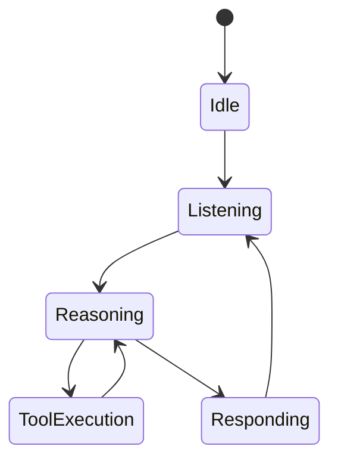
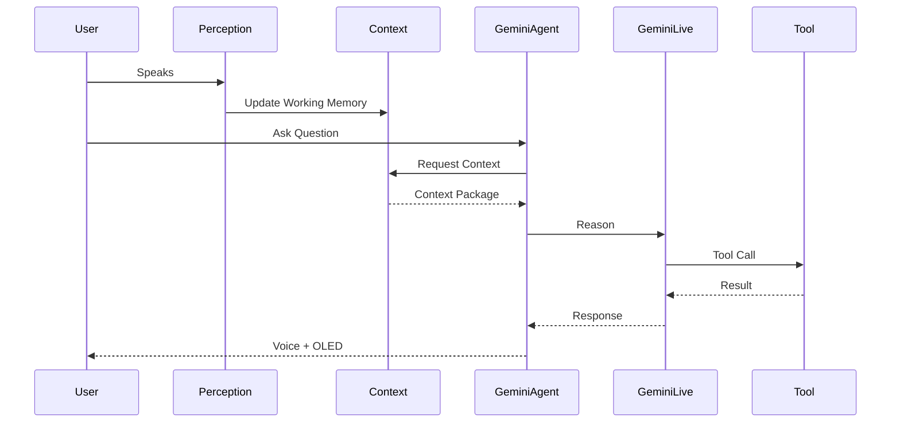

# Gemini Live Agent PRD

**Version:** 1.0  
**Status:** Draft  
**Owner:** AI Platform Team

---

# 1. Overview

The Gemini Live Agent is the real-time reasoning engine of the system.

Unlike the Memory OS, which is responsible for storing long-term knowledge, the Gemini Live Agent focuses exclusively on understanding the current interaction, performing reasoning, invoking external tools, and generating natural responses.

The agent is intentionally stateless with respect to long-term memory. Persistent knowledge is retrieved through the Context Engine and Memory OS.

This separation ensures that reasoning remains independent from memory management and allows the reasoning model to be replaced without redesigning the overall system.

---

# 2. Objectives

The Gemini Live Agent is designed to:

- Maintain a real-time conversational session.
- Understand multimodal user inputs.
- Consume structured context from Context Engine.
- Perform reasoning using Gemini Live.
- Invoke external tools when necessary.
- Generate natural voice and visual responses.
- Remain independent from memory storage.

---

# 3. High-Level Architecture

```mermaid
flowchart LR

User

↓

LiveKit

↓

GeminiLiveAgent

↓

ContextEngine

↓

GeminiLive

↓

ToolCalling

↓

Response
```

---

# 4. Internal Architecture

```mermaid
flowchart LR

Session

↓

ContextManager

↓

Reasoner

↓

ToolExecutor

↓

ResponseGenerator
```

---

# 5. Session Management

The Gemini Live Agent maintains a persistent realtime session.

Responsibilities include:

- Session initialization
- Authentication
- Streaming lifecycle
- Heartbeat monitoring
- Automatic reconnection
- Conversation state synchronization

The agent should tolerate temporary network interruptions without losing context.

---

# 6. Event-Driven Reasoning

Unlike conventional video analytics systems, the Gemini Live Agent is **not invoked continuously for every incoming frame**.

The camera streams continuously, while the Perception Engine processes approximately **one representative frame per second (~1 FPS)**.

The agent performs reasoning only when meaningful events occur.

Typical triggers include:

- A new person is recognized.
- An unknown face is detected.
- A conversation begins.
- The user explicitly asks a question.
- A reminder becomes relevant.
- Significant scene changes are detected.
- Tool execution requires additional reasoning.

This event-driven architecture minimizes unnecessary API calls while maintaining responsive interactions.

---

# 7. Context Acquisition

Before each reasoning cycle, the agent requests contextual information from the Context Engine.

The context package may include:

- Current observations
- Visible people
- Recent conversation
- Relevant semantic memories
- Episodic memories
- Calendar events
- Active reminders
- User preferences

The agent never queries storage directly.

---

# 8. Reasoning

The reasoning process is entirely delegated to Gemini Live.

Responsibilities include:

- Natural language understanding
- Multimodal reasoning
- Conversation management
- Decision making
- Tool selection
- Response generation

Reasoning is constrained by the supplied context package.

---

# 9. Tool Calling

The Gemini Live Agent supports structured function calling.

Example tools include:

| Tool              | Purpose                     |
| ----------------- | --------------------------- |
| search_person()   | Retrieve person information |
| search_memory()   | Search episodic memories    |
| create_reminder() | Create reminders            |
| create_event()    | Store calendar events       |
| update_person()   | Update personal profile     |
| register_face()   | Register a new face         |
| shopping_list()   | Manage shopping lists       |
| search_schedule() | Retrieve schedules          |

The agent selects tools based on reasoning results.

---

# 10. Response Generation

The response may include multiple modalities.

Examples:

- Spoken response
- OLED display text
- Tool execution confirmation
- Contextual reminder
- Follow-up question

The output is transmitted through LiveKit Data Channels and Audio Streams.

---

# 11. Conversation Lifecycle



---

# 12. Example Workflow



---

# 13. Failure Handling

If Gemini Live becomes unavailable:

- Continue updating Working Memory.
- Continue storing memories.
- Queue pending user requests.
- Notify the user gracefully.

If a tool fails:

- Retry when appropriate.
- Explain the failure.
- Continue the conversation.

The system should degrade gracefully rather than terminate the session.

---

# 14. Performance Strategy

The system prioritizes contextual reasoning over high-frequency inference.

Target operational characteristics:

| Metric               | Target       |
| -------------------- | ------------ |
| Camera Stream        | Continuous   |
| AI Vision Processing | ~1 FPS       |
| Context Refresh      | Event-driven |
| Tool Calls           | On-demand    |
| Reasoning            | Event-driven |
| Memory Updates       | Asynchronous |

This design reduces bandwidth, cloud GPU usage, and API costs while remaining sufficient for long-term memory assistance.

---

# 15. Future Extensions

Potential future capabilities include:

- Multi-agent collaboration
- Local fallback reasoning
- Personalized system prompts
- Adaptive reasoning strategies
- Multi-LLM routing
- Offline reasoning cache
- Streaming response optimization
- Emotion-aware dialogue

---

# 16. Design Principles

The Gemini Live Agent follows several core principles.

- Reasoning is stateless.
- Memory is externalized.
- Context precedes reasoning.
- Event-driven inference.
- Tool-first architecture.
- Modular LLM integration.
- Graceful degradation.
- Model-independent design.
