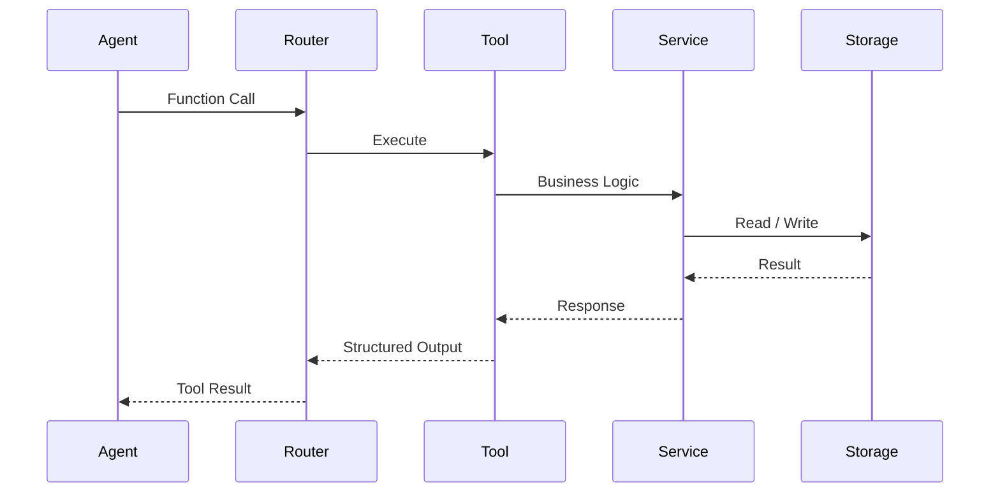

# Tool API PRD

**Version:** 1.0  
**Status:** Draft  
**Owner:** AI Platform Team

---

# 1. Overview

The Tool API provides a standardized interface that enables the Reasoning Agent to interact with external system capabilities.

Rather than granting direct access to databases or internal services, the Reasoning Agent communicates exclusively through Tool APIs. Each tool performs a well-defined operation, such as retrieving memories, registering new people, creating reminders, or updating user information.

This abstraction isolates business logic from the reasoning model, improves security, and allows individual services to evolve independently.

---

# 2. Objectives

The Tool API is designed to:

- Provide a secure interface between the Reasoning Agent and backend services.
- Encapsulate business logic behind reusable functions.
- Prevent direct database access from the LLM.
- Enable structured function calling.
- Return deterministic, machine-readable results.
- Simplify future integration of additional capabilities.

---

# 3. High-Level Architecture

```mermaid
flowchart LR

ReasoningAgent

↓

ToolRouter

↓

PersonTools

MemoryTools

ReminderTools

KnowledgeTools

SystemTools

↓

Backend Services

↓

Storage
```

---

# 4. Design Principles

The Tool API follows several architectural principles:

- Stateless execution.
- Single responsibility per tool.
- Structured inputs and outputs.
- No direct SQL or graph queries from the LLM.
- Idempotent operations where applicable.
- Versioned interfaces.
- Authentication and authorization at the service boundary.

---

# 5. Tool Categories

The Tool API is organized into functional domains.

| Category          | Purpose                           |
| ----------------- | --------------------------------- |
| Person Tools      | Manage people and face identities |
| Memory Tools      | Retrieve and update memories      |
| Reminder Tools    | Calendar and reminder management  |
| Knowledge Tools   | Query semantic knowledge          |
| Observation Tools | Access current environment        |
| System Tools      | Device and system status          |

---

# 6. Person Tools

These tools manage person identities and face-related information.

### Search Person

```text
search_person(person_id)
```

Returns:

- Name
- Relationship
- Preferences
- Recent interactions

---

### Search by Face

```text
search_person_by_face(face_embedding)
```

Returns:

- Person ID
- Similarity score
- Known profile

---

### Register Person

```text
register_person()
```

Creates a new person profile.

---

### Update Person

```text
update_person()
```

Updates attributes such as:

- Name
- Occupation
- Relationship
- Contact information

---

# 7. Memory Tools

Memory Tools provide access to episodic and semantic memories.

### Search Memory

```text
search_memory(query)
```

Example:

```
What did I discuss with Asep last week?
```

---

### Recent Memories

```text
recent_memories()
```

Returns recent interactions.

---

### Similar Memories

```text
similar_memories()
```

Retrieves semantically related experiences.

---

### Memory Timeline

```text
memory_timeline()
```

Returns chronological events.

---

# 8. Reminder Tools

Reminder management.

Supported operations include:

```text
create_reminder()

update_reminder()

delete_reminder()

search_reminders()

today_reminders()
```

Example output

```json
{
  "title": "Buy medicine",
  "date": "2026-08-07",
  "time": "09:00"
}
```

---

# 9. Knowledge Tools

Knowledge Tools interact with Semantic Memory.

Examples include:

```text
search_entity()

entity_relationships()

search_preferences()

related_people()

knowledge_graph()
```

Example

```
Who works with Asep?
```

↓

Knowledge Graph

↓

Result

---

# 10. Observation Tools

Observation Tools expose the latest context captured by the Perception Engine.

Examples:

```text
current_scene()

visible_people()

current_activity()

conversation_summary()
```

These tools only expose current context rather than long-term memory.

---

# 11. System Tools

System-level operations.

Examples:

```text
battery_status()

network_status()

device_information()

firmware_version()
```

Future versions may include:

- Device diagnostics
- OTA updates
- Performance metrics

---

# 12. Tool Execution Flow



---

# 13. Standard Request Schema

Every tool receives structured input.

Example

```json
{
  "tool": "search_memory",
  "parameters": {
    "query": "favorite food of Asep"
  }
}
```

---

# 14. Standard Response Schema

Every tool returns a consistent response format.

```json
{
  "success": true,
  "data": {},
  "confidence": 0.96,
  "execution_time_ms": 42
}
```

Errors follow the same structure.

```json
{
  "success": false,
  "error": {
    "code": "NOT_FOUND",
    "message": "Person not found."
  }
}
```

---

# 15. Security

The Reasoning Agent never receives direct access to:

- PostgreSQL
- Neo4j
- FAISS

All storage interactions must pass through backend services exposed by Tool APIs.

This architecture:

- Prevents accidental data corruption.
- Simplifies auditing.
- Enables access control.
- Allows storage technologies to change without affecting the reasoning layer.

---

# 16. Performance Strategy

Tools should be lightweight and deterministic.

General targets include:

| Metric               | Target       |
| -------------------- | ------------ |
| Average Response     | <300 ms      |
| Timeout              | 2 seconds    |
| Concurrent Execution | Supported    |
| Retry                | Configurable |

Long-running operations should execute asynchronously.

---

# 17. Future Extensions

Potential future tool categories include:

- Smart home integration
- Health monitoring
- Email and messaging
- Navigation
- Financial management
- Medication management
- Emergency assistance
- IoT device control
- Third-party APIs

---

# 18. Design Principles

The Tool API follows several core principles.

- LLMs never access storage directly.
- Every capability is exposed as a tool.
- Business logic belongs in services.
- Structured inputs and outputs.
- Deterministic execution.
- Storage-independent architecture.
- Modular and extensible design.
