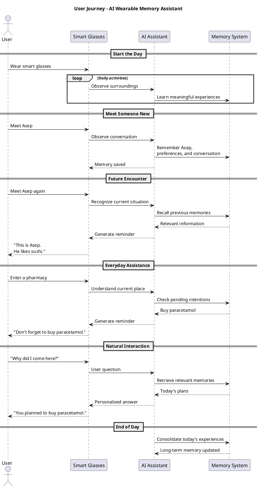

**Memora: An AI-Powered Smart Glasses Platform for Context-Aware Dementia Assistance**

**![][image1]**

Written by:

**PPL Startup Early Access**

Heraldo Arman (2406420702)

Muhammad Rifqi Ilham (2406495483)

Gerry Bima Putra (2406495464)

**Faculty of Computer Science**

**Universitas Indonesia**

**2026**

## **Executive Summary & Value Proposition** **Executive Summary** **Memora** is an AI-powered smart glasses platform designed to help people with early-to-mid stage dementia navigate everyday life more easily, by understanding their surroundings and recognizing people, places, and daily routines through natural voice interaction. In Indonesia alone, Dementia affects more than **2 million people** as of 2025, with over 30% of nearly 7 million elderly Indonesians assessed showed signs of cognitive impairment (Ministry of Health, 2026). Alzheimer's disease remains the dominant driver, accounting for 60–70% of cases and typically marked by progressive memory loss and difficulty recognizing familiar people and surroundings, yet formal diagnosis and specialist care remain concentrated in major urban centers, leaving many families in under-served regions to navigate this decline largely on their own. Conventional reminders like calendars, sticky notes or generic reminder apps rely on manual schedules and depend entirely on a caregiver’s manual input. Meanwhile, AI-powered wearable assistants have since emerged abroad, but remain purely reactive and built around a single, in-home caregiver, a structure that doesn't reflect Indonesian families, where care is often shared across relatives who don't live under the same roof. No existing solution, local or global, has been built for this reality. Memora combines real-time facial and object recognition with natural voice interaction to help patients recognize familiar faces, places, and daily routines the moment confusion occurs, without needing to remember to ask for help. A connected caregiver dashboard shares this in real time with every family member involved in care, regardless of who lives in the same house, replacing the single-caregiver assumption behind existing solutions with one built for how Indonesian families actually share care, from daily activity logs to alerts when the patient appears disoriented or is in an unfamiliar location. By pairing this intelligence with visibility for the people who care for them, Memora aims to improve independence, reduce confusion and anxiety, and enhance the quality of life for individuals experiencing cognitive impairment while also reducing the caregiving burden on families and healthcare professionals.

**Value Proposition**  
Unlike manual aids that depend entirely on someone remembering to use them, or wearable assistants abroad built for a single, in-home caregiver, Memora is designed for how Indonesian families actually navigate and share care.

**For Patients**:

- **Context-Aware Intelligence**: Understands people, places, objects, and ongoing activities in real time instead of relying solely on predefined reminders.
- **Hands-Free Interaction:** Natural voice guidance through the smart glasses, needing no screen or manual input

**For Family Caregivers**:

- **Real-Time Visibility**: Daily activity and disorientation alerts, replacing reliance on the patient's own recollection
- **Shared Access**: One dashboard for every family member involved in care, regardless of who lives in the same house, unlike existing wearable assistants abroad, built for a single in-home caregiver

# **Technical Architecture & Tech Stack** Our solution adopts a cloud-assisted IoT wearable architecture that integrates embedded systems, computer vision, multimodal artificial intelligence, and persistent memory into a unified cognitive assistance platform. The system is designed to continuously observe the user's surroundings, understand ongoing interactions, build long-term memories, and provide personalized assistance in real time. Unlike conventional AI assistants that rely solely on the context window of a Large Language Model (LLM), our architecture separates the system into three independent layers: Perception, Memory OS, and Reasoning. This modular design enables the system to maintain persistent long-term memories while allowing the reasoning engine to focus only on the most relevant contextual information, resulting in a more scalable and reliable architecture ([More detailed breakdown provided in appendix A](#bookmark=id.6wsrstg798u6)).

```mermaidjs

flowchart LR

subgraph Wearable
    Glasses["Smart Glasses
ESP32-S3 + Camera + OLED"]
end

subgraph Cloud

    Perception["👁️ Perception

• Face Recognition
• Scene Understanding
• Speech Recognition"]

    Memory["🧠 Memory OS

• Working Memory
• Long-term Memory
• Knowledge Graph"]

    Reasoning["🤖 Gemini Live

Reasoning
Tool Calling"]

end

subgraph Storage

    Neo["Neo4j"]

    SQL["PostgreSQL"]

    Vector["FAISS"]

end

Glasses --> Perception

Perception --> Memory

Memory --> Reasoning

Reasoning --> Memory

Memory --> Neo

Memory --> SQL

Memory --> Vector

Reasoning --> Glasses


```

**Figure 1** illustrates the overall system architecture.

## **1\. IoT Wearable & Perception Layer** The wearable prototype is built around the **Seeed Studio XIAO ESP32-S3 Sense**, equipped with an OV3660 camera, microphone, OLED display, rechargeable battery, and Wi-Fi connectivity. Rather than performing AI inference locally, the wearable functions as a lightweight IoT sensing device that continuously captures multimodal information and securely streams it to cloud services through **LiveKit**. ([Hardware design, component and concept are detailed in Appendix B](#bookmark=id.dulqlfcym3b5)) The cloud-based perception layer processes incoming visual and audio streams using multiple specialized AI models. **InsightFace** performs face detection and generates facial embeddings, while **FAISS** enables efficient similarity search to recognize previously encountered individuals. At the same time, **Gemini Vision** analyzes the surrounding environment, and speech is converted into text through Speech-to-Text processing. The outputs of these perception modules are combined into a **Working Memory**, which represents the user's current context, including visible people, ongoing conversations, and environmental information. This contextual representation serves as the foundation for subsequent memory formation and reasoning.

## **2\. Memory OS** The core innovation of the proposed system is **Memory OS**, a persistent memory engine that continuously transforms everyday experiences into structured long-term knowledge. Instead of storing raw conversations alone, the system processes every interaction through a **Memory Pipeline** consisting of three stages:

- **Memory Extraction**, which identifies meaningful facts from conversations and visual observations.
- **Memory Classification**, which categorizes extracted information into semantic entities such as people, relationships, preferences, events, and reminders.
- **Memory Consolidation**, which updates existing knowledge, removes duplication, and preserves historical information through timestamps.

Inspired by human cognition, Memory OS manages three complementary memory types:

- **Working Memory**, containing the current interaction context.
- **Semantic Memory**, storing factual long-term knowledge such as identities, occupations, preferences, and relationships.
- **Episodic Memory**, preserving historical interactions and experiences for future retrieval.

This architecture enables the system to accumulate knowledge over days or months while maintaining consistent and up-to-date information about the user's daily life.

```mermaidjs

flowchart LR

Experience["👀 Experience
(Camera + Audio)"]

Understand["🧩 Understand"]

Remember["🧠 Remember"]

Retrieve["🔎 Retrieve"]

Reason["🤖 Reason"]

Experience --> Understand

Understand --> Remember

Remember --> Retrieve

Retrieve --> Reason

Reason --> Remember

```

**Figure 2** illustrates the memory lifecycle adopted by the proposed system.

## **3\. Reasoning Layer**

The reasoning layer is powered by **Gemini Live**, which provides natural multimodal interaction through speech and vision. Rather than acting as the system's permanent memory, the LLM serves as an intelligent reasoning engine. Before generating a response, Gemini retrieves only the most relevant information from Memory OS using tool calling. By combining the current environmental context with previously stored memories, the system can deliver personalized reminders, identify familiar individuals, answer contextual questions, and maintain coherent long-term conversations without being limited by the LLM's context window.

## **4\. Technology Stack**

|         Layer          |                 Technology                  |
| :--------------------: | :-----------------------------------------: |
|    Wearable Device     | ESP32-S3 Sense, OV3660 Camera, OLED Display |
|  Embedded Development  |      Arduino Framework / ESP-IDF (C++)      |
| Realtime Communication |                   LiveKit                   |
|      Backend API       |                   FastAPI                   |
|      AI Framework      |                   Python                    |
|  Large Language Model  |                 Gemini Live                 |
|    Face Recognition    |                 InsightFace                 |
|     Vector Search      |                    FAISS                    |
|        Database        |                 PostgreSQL                  |
|    Knowledge Graph     |                    Neo4j                    |
|       Deployment       |                   Railway                   |
|        Monorepo        |                     NX                      |

## **Core Features & User Journey** Our Minimum Viable Product introduces an AI-powered wearable assistant that helps individuals with early-to-mid stage dementia navigate everyday life, while giving family caregivers real-time visibility into their loved one's wellbeing. Rather than functioning as a passive reminder tool that waits to be checked, the system continuously observes the patient's surroundings and delivers assistance the moment confusion occurs, without requiring the patient to initiate anything. Users interact with Memora entirely through natural voice conversation in Bahasa Indonesia. Patients can ask simple questions such as _"Siapa ini?"_, _"Dimana Aku?"_, or _"Aku harus ngapain?"_, while the assistant responds in real time without requiring screens, buttons, or manual input.

### **1\. Real-time Face Recognition** The assistant helps users recognize people they have previously met by remembering their identities and important personal details. During future encounters, it can provide contextual reminders such as names, relationships, occupations, or personal preferences, allowing users to engage in conversations with greater confidence.

### **2\. Context-Aware Memory Retrieval** Whenever the user encounters a familiar person, revisits a location, or asks a question, the assistant retrieves only the most relevant memories for the current situation. This allows users to instantly recall previous conversations, important facts, or shared experiences without manually searching through notes or history.

### **3\. Proactive Everyday Assistance** Beyond remembering people, the assistant continuously tracks daily intentions and important activities. It can remind users about shopping lists, medications, appointments, meetings, unfinished tasks, or personal commitments when they become contextually relevant. For example, if the user enters a pharmacy after previously planning to buy paracetamol, the system can proactively remind them before they leave.

### **4\. Caregiver Dashboard** A connected mobile where every family member involved in care, regardless of who lives in the same household, can view real-time activity logs and receive alerts when the patient appears disoriented or is in an unfamiliar location, replacing reliance on the patient's own recollection or occasional check-ins.

## **User Journey**



**Figure 3** illustrates the overall user journey.

## The user simply wears the smart glasses throughout the day while the system continuously observes the surrounding environment and builds structured long-term memories. As the user's context changes, such as meeting familiar people, visiting specific places, or starting new conversations, the assistant automatically retrieves relevant memories and provides concise contextual assistance. Users may also ask natural questions at any time, allowing the system to combine current observations with past experiences to deliver personalized memory support.

## **Minimum Viable Product Scope** The MVP validates the feasibility of a context-aware wearable memory assistant within the four-day hackathon timeline. It supports continuous multimodal perception, remembers people and conversations, stores long-term memories, retrieves contextually relevant information, proactively reminds users about intentions and commitments, answers natural-language questions, and presents concise assistance through a lightweight wearable interface. Features intentionally excluded from the MVP include mobile applications, offline inference, multi-device synchronization, advanced privacy controls, OTA firmware updates, battery optimization, and medical-grade diagnostic capabilities.

# **Business Strategy, Market, and Viability** **Market Opportunity** Dementia is becoming an increasingly urgent public health challenge as populations continue to age. According to Indonesia's Ministry of Health, more than 55 million people worldwide are currently living with dementia, with projections reaching 139 million by 2050\. In Indonesia alone, the Ministry of Health estimates 1.2 million people are living with dementia in 2016\. Estimates suggest that approximately 4 million people may be living with dementia by 2050\. Unlike conventional reminder applications that require manual input, our solution introduces a wearable AI memory assistant capable of continuously building contextual memories from everyday experiences. This creates a fundamentally different interaction model in which memory support becomes passive, proactive, and seamlessly integrated into daily life. ([Details in Appendix C](#bookmark=id.nh2uhyfn1apy))

### **Target Market** The initial target users are individuals experiencing early to mid-stage dementia, where preserving independence during everyday social interactions has the greatest impact. Secondary users include older adults experiencing age-related memory decline, family caregivers seeking better support tools, and healthcare providers interested in continuous cognitive assistance. For market estimation, we define

- **TAM (Total Addressable Market):** Individuals globally living with dementia and cognitive impairment who could benefit from AI-assisted memory support.
- **SAM (Serviceable Available Market):** Older adults and dementia patients in Indonesia, where the solution is initially developed and validated.
- **SOM (Serviceable Obtainable Market):** Early adopters, including hospitals, memory clinics, elderly care centers, and selected patient communities participating in pilot deployments.

> _![][image5]_

**Figure 4** illustrates the market sizing.

## **Business Model** Memora uses a hybrid revenue model: a **one-time hardware purchase** combined with a **monthly subscription** for the AI service, sold through two market channels, **B2C** (direct to families) and **B2B** (healthcare institutions).

1. ## **B2C: Direct to Family** Memora glasses are sold once near break-even, acting as an entry point rather than a profit center, with 0% installment options (3–6 months via Kredivo/Akulaku) to ease the price barrier for middle-class families. The real revenue driver is the monthly subscription across three tiers: Basic (face recognition, voice assistance, basic reminders for one caregiver), Family (adds a real-time multi-caregiver dashboard and disorientation/location alerts), and Family+ (adds long-term memory history, weekly reports, and priority support).

2. ## **B2B**: **Hospital & Institutional** Target institutions are hospitals/memory clinics, elderly care centers, and private insurers. Instead of outright purchase, they lease glasses in bulk at lower per-unit cost on contract terms that suit hospital budget cycles, plus a per-bed/per-patient monthly dashboard license for staff monitoring multiple patients, similar to per-seat SaaS pricing. A mid-term data/insight partnership (anonymized, consent-based, for clinical research) adds long-term differentiation, though it's not a near-term revenue driver.

## **Go-To-Market Strategy** Memora's GTM rolls out in phases, starting with small-scale clinical validation before scaling to the broader consumer market, an important approach since Memora touches sensitive data (faces, location, health status of dementia patients), so trust needs to be built through credible institutions first.

1. ## **Phase 1: Pilot & Validation (Month 0–6)** Launch a pilot program with 1–2 hospitals in Greater Jakarta, involving 10–20 dementia patients to validate AI accuracy, usability, and caregiver experience. Simultaneously, collaborate with caregiver communities such as ALZI to refine product-market fit and validate B2C pain points before commercial launch.

2. ## **Phase 2: Direct-to-Consumer Awareness (Month 6–12)** Launch through a hybrid B2B2C model by partnering with hospitals, clinics, and caregiver communities while running educational campaigns targeting Indonesia's sandwich generation (adults aged 30–50 caring for aging parents). The objective is to acquire approximately 4,000 adopters within the first year.

3. ## **Phase 3: Scale & Institutional Expansion (Month 12+)** Expand partnerships with hospitals, insurers, and elderly care centers across Indonesia while introducing regional language support and institutional subscription models.

# **Vision & Expected Impact** Dementia gradually takes away the ability to remember people, places, and daily routines, often increasing dependence on family caregivers. Memora aims to restore confidence in everyday interactions by providing contextual memory assistance exactly when it is needed, while giving caregivers greater peace of mind through real-time visibility. By combining AI with wearable technology, Memora envisions a future where people living with dementia can navigate daily life with greater confidence and families can provide better care without constant supervision.

**APPENDIX**

# **Appendix A – Detailed Technical Architecture**

This appendix provides a comprehensive explanation of the proposed system architecture. While the main proposal presents the overall architecture at a high level, this section describes how each subsystem interacts to continuously capture experiences, build persistent memories, and provide contextual cognitive assistance. The complete architecture is illustrated in **Figure A-1**. And can be accessed into [ristek.link/memora-architecture](http://ristek.link/memora-architecture) in case the images is blurry

```mermaidjs
flowchart LR
 subgraph DEVICE["Smart Glasses (ESP32-S3)"]
        CAM["📷 OV3660 Camera"]
        MIC["🎤 Microphone"]
        OLED["🖥️ OLED Display"]
        FW["Firmware"]
  end
 subgraph LIVEKIT["LiveKit Realtime"]
        VIDEO["Video Track"]
        AUDIO["Audio Track"]
        DATA["Data Channel"]
  end
 subgraph PERCEPTION["Perception Layer"]
        FRAME["Frame Sampler\n(~1 FPS)"]
        FACE["InsightFace"]
        FAISS["Face Retrieval"]
        VISION["Gemini Vision"]
        STT["Speech-to-Text"]
  end
 subgraph WORKING["Working Memory"]
        CTX["Current Context"]
        VISIBLE["Visible People"]
        SCENE["Scene State"]
  end
 subgraph MEMORY_PIPELINE["Memory Pipeline"]
        EXTRACT["Memory Extraction"]
        CLASSIFY["Memory Classification"]
        CONSOLIDATE["Memory Consolidation"]
  end
 subgraph MEMORY_OS["Memory OS"]
        SEMANTIC["Semantic Memory"]
        EPISODIC["Episodic Memory"]
        GRAPH["Knowledge Graph"]
        RETRIEVAL["Context Retrieval"]
        RANK["Memory Ranking"]
        TOOLS["Tool API"]
  end
 subgraph STORAGE["Persistent Storage"]
        POSTGRES["PostgreSQL"]
        NEO4J["Neo4j"]
        FAISS_DB["FAISS Index"]
  end
 subgraph AGENT["Reasoning Layer"]
        PROMPT["Prompt Builder"]
        LLM["Gemini Live"]
        FUNCTION["Tool Calling"]
  end
    CAM --> FW
    MIC --> FW
    FW --> OLED & WIFI["WiFi"] & OLED
    WIFI --> LIVEKIT
    VIDEO --> FRAME
    FRAME --> FACE & VISION
    FACE --> FAISS
    AUDIO --> STT
    FAISS --> VISIBLE
    VISION --> SCENE
    VISIBLE --> CTX
    SCENE --> CTX
    STT --> CTX
    CTX --> EXTRACT & PROMPT
    EXTRACT --> CLASSIFY
    CLASSIFY --> CONSOLIDATE
    CONSOLIDATE --> SEMANTIC & EPISODIC
    SEMANTIC --> GRAPH & NEO4J & FAISS_DB
    GRAPH --> RANK
    TOOLS --> RETRIEVAL
    RANK --> RETRIEVAL
    EPISODIC --> POSTGRES
    POSTGRES --> RETRIEVAL
    NEO4J --> RETRIEVAL
    FAISS_DB --> RETRIEVAL
    RETRIEVAL --> PROMPT
    PROMPT --> LLM
    LLM --> FUNCTION & DATA & AUDIO_REPLY["Voice Response"]
    FUNCTION --> TOOLS
    DATA --> FW
    AUDIO_REPLY --> LIVEKIT
```

**Figure A-1** – Full Architecture

## **A.1 System Overview**

The proposed solution is designed as a cloud-assisted wearable AI system consisting of six major subsystems:

1. Smart Wearable Device
2. Realtime Communication Layer
3. Perception Layer
4. Working Memory & Memory Pipeline
5. Memory OS
6. Reasoning Layer

Rather than executing all artificial intelligence models directly on the wearable hardware, computationally intensive tasks are offloaded to cloud infrastructure. This approach significantly reduces power consumption, simplifies embedded hardware requirements, and enables the AI system to evolve independently without requiring firmware updates. The wearable primarily functions as an intelligent sensing device that continuously captures multimodal information and delivers contextual assistance back to the user.

## **A.2 Smart Wearable Device**

The wearable prototype is built around the **Seeed Studio XIAO ESP32-S3 Sense**, selected because it integrates Wi-Fi, Bluetooth, camera support, and sufficient processing capability within a compact form factor suitable for wearable applications. The device consists of several hardware components:

- OV3660 Camera
- Built-in microphone
- OLED display
- Rechargeable battery
- Charging module

Unlike conventional smart glasses that perform local inference, the wearable does not execute large computer vision or language models. Instead, it periodically captures image frames, streams audio, receives user interactions, and displays contextual information generated by the cloud. This design minimizes computational load while extending battery life and allowing future upgrades to AI models without modifying the embedded hardware.

## **A.3 Realtime Communication Layer**

Communication between the wearable device and cloud infrastructure is handled using **LiveKit**, which serves as the realtime multimedia communication platform. Three communication channels are utilized:

- Video Track
- Audio Track
- Data Channel

The Video Track periodically transmits camera frames to the perception layer. The Audio Track continuously streams conversations for speech recognition and contextual understanding. The Data Channel delivers lightweight bidirectional messages such as:

- User interaction events
- Reminder notifications
- Recognized identities
- Display instructions
- Future firmware commands

Using persistent realtime communication eliminates repeated HTTP requests and provides significantly lower latency for continuous multimodal interaction.

## **A.4 Perception Layer**

The perception layer transforms raw sensor data into structured contextual information. Incoming image frames are first sampled to reduce unnecessary computation. Since dementia assistance does not require high-frame-rate visual processing, a sampling rate of approximately one frame per second is sufficient for identifying people and understanding conversational context while substantially reducing bandwidth and inference costs. Each sampled frame is processed by multiple specialized perception modules.

### **A4.1 Face Recognition**

InsightFace performs:

- Face detection
- Face alignment
- Face embedding generation

Generated facial embeddings are compared against previously stored embeddings using FAISS. If a sufficiently similar embedding is found, the corresponding identity is retrieved. Otherwise, the system marks the individual as an unknown person and may later create a new identity after user confirmation.

### **A.4.2 Scene Understanding**

Gemini Vision analyzes the surrounding environment to understand:

- Current location
- Visible objects
- Ongoing activities
- Environmental context

This information provides additional situational awareness that complements face recognition.

### **A.4.3 Speech Recognition**

Audio streams are converted into text using Speech-to-Text processing. The generated transcript becomes one of the primary inputs for long-term memory formation.

## **A.5 Working Memory**

Working Memory stores temporary contextual information associated with the current interaction.

Typical information includes:

- Visible people
- Current conversation
- Environmental context
- User requests
- Recently recognized objects

Unlike long-term storage, Working Memory exists only during the current interaction and continuously updates as new observations arrive. This temporary context significantly reduces unnecessary database retrieval while maintaining coherent conversations.

## **A.6 Memory Pipeline**

The Memory Pipeline converts temporary experiences into structured long-term knowledge. The pipeline consists of three sequential stages.

### **A.6.1 Memory Extraction**

The transcript and visual context are analyzed to identify meaningful information. Examples include:

- Personal identities
- Occupations
- Family relationships
- Personal preferences
- Future events
- Shopping items
- Appointments

Rather than preserving every spoken sentence, only semantically valuable information is extracted.

### **A.6.2 Memory Classification**

Extracted knowledge is categorized into predefined semantic classes. Examples include:

- Person
- Place
- Event
- Preference
- Relationship
- Reminder
- Schedule

Semantic classification enables efficient retrieval during future conversations.

### **A.6.3 Memory Consolidation**

Before storing new information, the system compares it against previously stored knowledge. If information already exists, the memory is updated instead of duplicated. Historical versions remain preserved with timestamps, enabling the system to understand changes over time while maintaining a consistent representation of long-term knowledge.

## **A.7 Memory OS**

Memory OS functions as the persistent cognitive engine of the entire platform. Instead of treating conversations as isolated interactions, Memory OS continuously accumulates knowledge across days, weeks, and months. Three complementary memory types are maintained.

### **A7.1 Working Memory**

Maintains temporary contextual information for the current interaction.

### **A.7.2 Semantic Memory**

Stores factual knowledge including:

- Names
- Occupations
- Relationships
- Personal preferences
- Frequently visited places
- Important routines

### **A.7.3 Episodic Memory**

Stores chronological records of previous interactions, conversations, and experiences. This separation closely resembles cognitive memory models and allows efficient retrieval depending on the user's current needs.

## **A.8 Persistent Storage**

Different storage technologies are selected according to their strengths.

### **A.8.1 PostgreSQL**

Stores structured application data including:

- User profiles
- Conversation metadata
- Shopping lists
- Reminder schedules
- Calendar events

### **A.8.2 Neo4j**

### Models relationships among people, locations, events, and memories as a knowledge graph. This enables relationship-aware reasoning such as:

- Who is Asep?
- Who works with Budi?
- Which family member visited yesterday?

### **A.8.3 FAISS**

Stores facial embeddings for high-performance similarity search. This enables efficient recognition even as the number of known individuals continues to grow.

## **A.9 Reasoning Layer**

The reasoning layer is powered by Gemini Live. Unlike traditional conversational agents, Gemini is not responsible for storing long-term knowledge. Instead, before generating a response, the system retrieves only the most relevant contextual information from Memory OS. The reasoning engine therefore receives:

- Current Working Memory
- Retrieved Semantic Memory
- Relevant Episodic Memory
- User query

This retrieval-augmented approach enables personalized responses while avoiding unnecessary expansion of the LLM context window. When additional information is required, Gemini invokes Memory OS through tool calling, retrieves the necessary knowledge, and incorporates the results into its final response.

## **A.10 End-to-End Workflow**

The complete system operates through the following sequence:

1. The wearable continuously captures visual and audio information.
2. LiveKit streams multimodal data to cloud services.
3. The perception layer performs face recognition, scene understanding, and speech transcription.
4. Working Memory maintains the user's current contextual state.
5. The Memory Pipeline extracts meaningful information from conversations and observations.
6. Memory Consolidation integrates new knowledge into Memory OS.
7. Knowledge is persistently stored in PostgreSQL, Neo4j, and FAISS.
8. When assistance is requested, Memory OS retrieves the most relevant memories.
9. Gemini Live performs reasoning based on both the retrieved memories and current environmental context.
10. Personalized guidance is transmitted back to the wearable through the OLED display and future audio output.

This architecture enables the wearable to function not merely as an AI assistant, but as a persistent cognitive companion capable of continuously learning from everyday experiences and providing contextual memory assistance throughout the user's daily life.

#

# **Appendix B – Hardware Design Reference**

This appendix presents the conceptual hardware design of the proposed wearable device. **Since the prototype has not been developed yet, the figures included in this section are intended as visual references rather than the final product design**. These references illustrate the expected physical appearance, component placement, and optical concept that will be implemented during prototype development. The wearable is designed as a lightweight smart glasses platform capable of continuously capturing visual and audio information while providing contextual assistance through a compact heads-up display (HUD). The design prioritizes comfort, portability, and ease of assembly using commercially available components.

## **B.1 Overall Wearable Concept**

**Figure B-1** presents the overall design inspiration for the proposed smart glasses. The final prototype will follow a similar form factor while integrating the required sensing and display modules. The Oled would be used by the user to get information on what they are seeing. And the camera is used to get information on the user perspective

![][image7]

**![][image8]**

**Figure B-1** – Smart Glasses Design Reference (source: [ristek.link/references-1](http://ristek.link/references-1) [ristek.link/references-2](http://ristek.link/references-2))

## **B.2 Hardware Components**

The wearable prototype is assembled from several off-the-shelf hardware modules to simplify rapid prototyping while maintaining low development cost.

The primary hardware components include:

- Seeed Studio XIAO ESP32-S3 Sense
- OV3660 Camera Module
- OLED Display
- Rechargeable Battery
- Battery Charging Module
- Optical Combiner (Semi-Reflective Display)
- Custom Acrylic Mount
- Eyeglass Frame

**Figure B-2** illustrates the planned hardware components used in the prototype.

**![][image9]**![][image10]**![][image11]**![][image12]

**Figure B-2 –** Hardware Components Reference (sources: tokopedia)

## **B.3 Optical Display Concept**

Instead of using expensive commercial AR displays, the prototype adopts a lightweight optical combiner approach inspired by DIY head-up display (HUD) systems. A small OLED display projects information onto a semi-reflective transparent surface positioned in front of one eye. The reflected image creates the illusion of floating digital information while allowing the user to maintain visibility of the surrounding environment.

This approach offers several advantages:

- Low hardware cost
- Lightweight construction
- Easy fabrication
- Suitable for rapid prototyping
- Sufficient for displaying contextual reminders and identity information

**Figure B-3** illustrates the optical display concept.

![][image13]

**Figure B-3 –** Optical Combiner / HUD Reference (source: [ristek.link/references-hud](http://ristek.link/references-hud))

## **B.4 Mechanical Design**

The electronic components are mounted onto a custom acrylic structure attached to a standard eyeglass frame. The acrylic mount provides structural support for the ESP32 module, camera, display, battery, and optical components while maintaining a compact wearable form factor. The modular mechanical design also allows future hardware upgrades without redesigning the entire wearable system.

## **B.5 3D CAD Design**

To support fabrication and future iterations, the complete wearable assembly will be modeled using 3D CAD software prior to manufacturing. The CAD design also enables rapid modification and future migration toward custom PCB integration.

**Figure B-5** presents the preliminary 3D CAD concept of the wearable prototype.

**![][image14]**

**Figure B-5** – 3D CAD Model (source: [ristek.link/3d-cad-references](http://ristek.link/3d-cad-references))

## **B.6 Future Hardware Development**

The current prototype is intended as a proof of concept for the hackathon. Future iterations may include:

- Custom PCB integrating the ESP32 and power management circuitry
- Smaller camera module for improved ergonomics
- Bone-conduction speaker for private audio feedback
- Inertial Measurement Unit (IMU) for head tracking
- Ambient light sensor for adaptive display brightness
- Higher-capacity battery with optimized power management
- Custom 3D-printed enclosure for improved durability and comfort

These enhancements can be implemented without significant changes to the cloud-based software architecture, demonstrating the scalability and modularity of the proposed system.

# **Appendix C \- Business Strategy, Market, and Viability**

## **C.1 Market Background**

Dementia is one of the fastest-growing global health challenges as populations continue to age. Beyond memory loss, dementia significantly impacts independence, social interaction, and quality of life. Patients frequently forget names, conversations, appointments, daily intentions, and important commitments, creating increasing dependency on caregivers.

Current digital solutions primarily rely on manual note-taking or calendar reminders, requiring users to actively record information before it can be recalled later. Unfortunately, individuals experiencing cognitive decline often forget to create these notes in the first place.

Our solution introduces a fundamentally different paradigm. Instead of requiring manual input, the wearable continuously observes the user's surroundings, automatically builds structured long-term memories, and proactively retrieves relevant information whenever it becomes contextually useful. Rather than functioning as a reminder application, the system behaves as a **context-aware memory operating system**.

# **C.2 Target Customers**

The platform is designed with multiple customer segments, beginning from healthcare before expanding into broader consumer applications.

## **Primary Segment**

Individuals diagnosed with:

- Early-stage Alzheimer's Disease
- Early-stage Dementia
- Mild Cognitive Impairment (MCI)

These users still maintain relatively independent daily activities but increasingly struggle to remember names, conversations, appointments, and ongoing commitments.

## **Secondary Segment**

Family members and caregivers. The wearable helps reduce caregiver burden by assisting patients during daily interactions while maintaining greater independence.

Potential customers include:

- Children caring for elderly parents
- Professional caregivers
- Home nursing services

## **Institutional Segment**

Healthcare organizations. Examples include:

- Hospitals
- Neurology clinics
- Memory clinics
- Elderly care facilities
- Assisted living communities

Institutional adoption may significantly accelerate distribution compared to direct consumer sales.

# **C.3 Market Size Estimation**

To estimate the commercial opportunity, we use a blended Annual Revenue Per User (ARPU) consisting of:

- Smart wearable hardware
- Annual cloud AI subscription

##

## **Pricing Assumptions**

| Component           | Price        |
| ------------------- | ------------ |
| Smart Glasses       | USD 140      |
| AI Subscription     | USD 11/month |
| Annual Subscription | USD 132      |
| **First-Year ARPU** | **USD 275**  |

The hardware is purchased once, while cloud AI services generate recurring subscription revenue.

# **C.4 TAM, SAM, SOM**

## **Total Addressable Market (TAM)**

According to the World Health Organization (WHO), approximately **57 million people worldwide** are living with dementia.

Assuming: _57,000,000 users × USD275 / year \= USD15.675 Billion/year_

Therefore, TAM ≈ USD 15.675 Billion annually

## **Serviceable Available Market (SAM)**

Indonesia is projected to have approximately **4 million dementia patients by 2050**, according to Indonesia's Ministry of Health and Alzheimer's Disease International projections.

_4,000,000 users × USD275 \= USD1.1 Billion/year_

Therefore, SAM ≈ USD 1.1 Billion annually

## **Serviceable Obtainable Market (SOM)**

For an initial deployment, we assume reaching only **0.1%** of Indonesia's projected dementia population.

_4,000 users × USD275 \= USD1.1 Million/year_

This represents an intentionally conservative estimate suitable for an early-stage startup.

![][image15]

**Figure C-4** – Visualization of market sizing

# **C.5 Revenue Model**

The proposed business model combines hardware sales with recurring software subscriptions.

## **Hardware**

One-time purchase:

- Smart glasses
- Charging accessories
- Initial setup

## **Subscription**

Monthly subscription includes:

- Cloud AI inference
- Long-term memory storage
- Continuous personalization
- Memory retrieval
- Future feature updates

Recurring subscriptions provide sustainable revenue while reducing hardware margin dependency.

## **Institutional Licensing**

Future revenue opportunities include enterprise licensing for:

- Hospitals
- Elderly care facilities
- Assisted living providers
- Insurance partners

Organizations may subscribe on behalf of multiple patients under centralized management.

**C6. GTM AIDAR Framework**

**Awareness**

- Educational short-form content on Instagram/TikTok about dementia warning signs, aimed at the "sandwich generation" (adults 30–50 with aging parents).
- Guest appearances/collaborations with geriatricians and psychiatrists to lend medical credibility.
- SEO-driven articles targeting search terms like "orang tua sering lupa jalan pulang" or "tanda awal demensia."

**Interest**

- Landing page with a short self-assessment quiz ("Does your parent show these signs?") that connects cognitive symptoms directly to Memora's features.
- Demo videos showing real scenarios: a patient asking "Siapa ini?" and getting an instant contextual answer.
- Testimonials from the Phase 1 pilot clinics to build early social proof.

**Desire**

- Free 14-day dashboard trial for caregivers (without hardware) using a companion "shadow mode" — lets a family caregiver see what the alerts and daily logs would look like, without full glasses purchase.
- Comparison content positioning Memora against manual reminders (sticky notes, generic apps) — reinforcing the value of passive, always-on assistance.
- Limited-time installment offers (0% 3–6 months) to reduce the psychological barrier of the hardware price.

**Action**

- Simple checkout flow bundling hardware purchase \+ first month subscription in one transaction.
- Assisted onboarding call (human, not just app-based) — important for an older, less tech-native buyer persona; the actual buyer decision-maker is often the adult child, but setup involves the elderly patient.
- Referral incentive: existing subscribers get a discount for referring another family in the same caregiver community/support group.

**Retention**

- Weekly recap reports sent to caregivers ("your parent had 3 disorientation alerts this week, mostly near the market"), keeps perceived value visible, not just passive background use.
- Proactive customer success check-ins during the first 30 days, when churn risk is highest (device adoption friction, patient discomfort wearing glasses).
- Tiered upgrade path (Basic → Family → Family+) as caregiving needs increase over time, keeping expansion revenue within the existing base rather than requiring new acquisition.

# **C.7 Competitive Positioning**

| Capability                                           | Manual Care | CrossSense                               | Other AI Assistants | Memora                                                                            |
| ---------------------------------------------------- | ----------- | ---------------------------------------- | ------------------- | --------------------------------------------------------------------------------- |
| Personalized memory recall                           | ❌          | ✅                                       | △ Limited           | ✅                                                                                |
| Real-time face recognition                           | ❌          | ✅                                       | △                   | ✅                                                                                |
| Context-aware reminders                              | ❌          | ✅                                       | △                   | ✅                                                                                |
| Natural voice interaction                            | ❌          | ✅                                       | ✅                  | ✅                                                                                |
| **Multi-caregiver dashboard**                        | ❌          | △ Single caregiver/patient focus         | ❌                  | ✅ Multiple family members can monitor one patient simultaneously                 |
| **Indonesian language & cultural support**           | ❌          | ❌ Primarily designed for global markets | △                   | ✅ Optimized for Bahasa Indonesia, local names, and everyday interactions         |
| **Integration with Indonesian healthcare ecosystem** | ❌          | ❌                                       | ❌                  | ✅ Designed for hospitals, memory clinics, and caregiver communities in Indonesia |
| **Institutional deployment**                         | ❌          | △                                        | ❌                  | ✅ Supports hospital dashboards and multi-patient monitoring                      |

While existing AI wearables such as CrossSense provide cognitive assistance for individuals with dementia, **Memora is designed specifically for the Indonesian healthcare ecosystem.** Beyond personalized memory support, Memora enables multi-caregiver collaboration, supports Bahasa Indonesia interactions, and is designed for integration with local hospitals, memory clinics, and caregiver communities, making it more practical for real-world adoption in Indonesia.

C.8 Long-Term Product Vision

Although the hackathon MVP focuses on dementia assistance, the underlying Memory OS is intentionally designed as a reusable platform.

Future applications include:

- ADHD support
- Age-related memory decline
- Traumatic brain injury rehabilitation
- Professional meeting assistants
- Personal knowledge management
- Universal wearable AI companions

The same architecture can also support future wearable devices beyond smart glasses, including smart earbuds, AR glasses, smartwatches, and mixed-reality headsets.

# **C.9 Risks and Mitigation**

| Risk                 | Mitigation                                                                            |
| -------------------- | ------------------------------------------------------------------------------------- |
| Privacy concerns     | End-to-end encryption, explicit user consent, configurable memory retention policies  |
| AI hallucination     | Retrieval-Augmented Generation (RAG) grounded on verified long-term memories          |
| Cloud latency        | Low-frequency (\~1 FPS) multimodal perception with asynchronous processing            |
| User adoption        | Passive hands-free interaction requiring minimal user intervention                    |
| Hardware limitations | Keep wearable lightweight while offloading all AI computation to cloud infrastructure |

**REFERENCES**

Alzheimer's Disease International (2019) _World Alzheimer Report 2019: Attitudes towards dementia_. London: Alzheimer's Disease International. Available at: [https://www.alzint.org/resource/world-alzheimer-report-2019/](https://www.alzint.org/resource/world-alzheimer-report-2019/) (Accessed: 4 August 2026).

Alzheimer's Disease International (2023) _World Alzheimer Report 2023: Reducing dementia risk: Never too early, never too late_. London: Alzheimer's Disease International. Available at: [https://www.alzint.org/resource/world-alzheimer-report-2023/](https://www.alzint.org/resource/world-alzheimer-report-2023/) (Accessed: 4 August 2026).

Alzheimer's Indonesia (2024) _Statistik tentang Demensia_ \[Statistics on Dementia\]. Available at: [https://alzi.or.id/statistik-tentang-demensia/](https://alzi.or.id/statistik-tentang-demensia/) (Accessed: 4 August 2026).

Livingston, G., Huntley, J., Sommerlad, A., Ames, D., Ballard, C., Banerjee, S., Brayne, C., Burns, A., Cohen-Mansfield, J., Cooper, C., et al. (2020) 'Dementia prevention, intervention, and care: 2020 report of the Lancet Commission', _The Lancet_, 396(10248), pp. 413–446. doi: 10.1016/S0140-6736(20)30367-6.

Livingston, G., Huntley, J., Liu, K., Costafreda, S.G., Selbæk, G., et al. (2024) 'Dementia prevention, intervention, and care: 2024 report of the Lancet standing Commission', _The Lancet_, 404(10452), pp. 572–628. doi: 10.1016/S0140-6736(24)01296-0.

Nichols, E., Steinmetz, J.D., Vollset, S.E., Fukutaki, K., Chalek, J., et al. (2022) 'Estimation of the global prevalence of dementia in 2019 and forecasted prevalence in 2050: an analysis for the Global Burden of Disease Study 2019', _The Lancet Public Health_, 7(2), pp. e105–e125. doi: 10.1016/S2468-2667(21)00249-8.

Prince, M., Ali, G.-C., Guerchet, M., Prina, M., Albanese, E. and Wu, Y.-T. (2016) 'Recent global trends in the prevalence and incidence of dementia, and survival with dementia', _Alzheimer's Research & Therapy_, 8(1), article 23\. doi: 10.1186/s13195-016-0188-8.

Putri, Y.S.E., Putra, I.G.N.E., Falahaini, A. and Wardani, I.Y. (2022) 'Factors associated with caregiver burden in caregivers of older patients with dementia in Indonesia', _International Journal of Environmental Research and Public Health_, 19(19), article 12437\. doi: 10.3390/ijerph191912437.

World Health Organization (2021) _Global status report on the public health response to dementia_. Geneva: WHO. Available at: [https://www.who.int/publications/i/item/9789240033245](https://www.who.int/publications/i/item/9789240033245) (Accessed: 5 August 2026).

World Health Organization (2026) _Dementia: Fact sheet_. Geneva: WHO. Available at: [https://www.who.int/news-room/fact-sheets/detail/dementia](https://www.who.int/news-room/fact-sheets/detail/dementia) (Accessed: 5 August 2026).

Atkinson, R.C. and Shiffrin, R.M. (1968) 'Human memory: A proposed system and its control processes', in Spence, K.W. and Spence, J.T. (eds.) _The Psychology of Learning and Motivation: Advances in Research and Theory_, vol. 2\. New York: Academic Press, pp. 89–195. doi: 10.1016/S0079-7421(08)60422-3.

Baltrušaitis, T., Ahuja, C. and Morency, L.-P. (2019) 'Multimodal machine learning: A survey and taxonomy', _IEEE Transactions on Pattern Analysis and Machine Intelligence_, 41(2), pp. 423–443. doi: 10.1109/TPAMI.2018.2798607.

Hogan, A., Blomqvist, E., Cochez, M., d'Amato, C., de Melo, G., Gutiérrez, C., Gayo, J.E.L., Kirrane, S., Neumaier, S., Ngomo, A.-C.N., et al. (2021) 'Knowledge graphs', _ACM Computing Surveys_, 54(4), pp. 1–37. doi: 10.1145/3447772.

Ienca, M., Wangmo, T., Jotterand, F., Kressig, R.W. and Elger, B. (2018) 'Ethical design of intelligent assistive technologies for dementia: A descriptive review and analysis', _Science and Engineering Ethics_, 24(4), pp. 1035–1055. doi: 10.1007/s11948-017-9976-1.

Lewis, P., Perez, E., Piktus, A., Petroni, F., Karpukhin, V., Goyal, N., Küttler, H., Lewis, M., Yih, W., Rocktäschel, T., Riedel, S. and Kiela, D. (2020) 'Retrieval-augmented generation for knowledge-intensive NLP tasks', _Advances in Neural Information Processing Systems_, 33 (NeurIPS 2020), pp. 9459–9474. Available at: [https://arxiv.org/abs/2005.11401](https://arxiv.org/abs/2005.11401).

Patel, S., Park, H., Bonato, P., Chan, L. and Rodgers, M. (2012) 'A review of wearable sensors and systems with application in rehabilitation', _Journal of NeuroEngineering and Rehabilitation_, 9(1), article 21\. doi: 10.1186/1743-0003-9-21.

Schroff, F., Kalenichenko, D. and Philbin, J. (2015) 'FaceNet: A unified embedding for face recognition and clustering', in _Proceedings of the IEEE Conference on Computer Vision and Pattern Recognition (CVPR)_, pp. 815–823. doi: 10.1109/CVPR.2015.7298682.

Tulving, E. (1972) 'Episodic and semantic memory', in Tulving, E. and Donaldson, W. (eds.) _Organization of Memory_. New York: Academic Press, pp. 381–403.

Deng, J., Guo, J., Xue, N. and Zafeiriou, S. (2019) 'ArcFace: Additive angular margin loss for deep face recognition', in _Proceedings of the IEEE/CVF Conference on Computer Vision and Pattern Recognition (CVPR)_, pp. 4690–4699. doi: 10.1109/CVPR.2019.00482. (Core method behind InsightFace)

Espressif Systems (2024) _ESP-IDF Programming Guide_. Available at: [https://docs.espressif.com/projects/esp-idf/en/latest/esp32/](https://docs.espressif.com/projects/esp-idf/en/latest/esp32/) (Accessed: 6 August 2026).

Google (2024) _Gemini Live API overview_. Available at: [https://ai.google.dev/gemini-api/docs/live-api](https://ai.google.dev/gemini-api/docs/live-api) (Accessed: 6 August 2026).

Johnson, J., Douze, M. and Jégou, H. (2021) 'Billion-scale similarity search with GPUs', _IEEE Transactions on Big Data_, 7(3), pp. 535–547. doi: 10.1109/TBDATA.2019.2921572. (FAISS)

LiveKit (2024) _LiveKit Documentation_. Available at: [https://docs.livekit.io/](https://docs.livekit.io/) (Accessed: 6 August 2026).

Neo4j (2024) _Neo4j Documentation_. Available at: [https://neo4j.com/docs/](https://neo4j.com/docs/) (Accessed: 6 August 2026).

Ramírez, S. (2024) _FastAPI_. Available at: [https://fastapi.tiangolo.com/](https://fastapi.tiangolo.com/) (Accessed: 6 August 2026).

Seeed Studio (2024) _XIAO ESP32S3 Sense: Mini ESP-CAM Dev Board for Edge AI_. Available at: [https://www.seeedstudio.com/XIAO-ESP32S3-Sense-p-5639.html](https://www.seeedstudio.com/XIAO-ESP32S3-Sense-p-5639.html) (Accessed: 6 August 2026).

W3C (2023) _WebRTC 1.0: Real-Time Communication Between Browsers_. W3C Recommendation. Available at: [https://www.w3.org/TR/webrtc/](https://www.w3.org/TR/webrtc/) (Accessed: 6 August 2026).

Arduino glasses a HMD for multimeter (no date) Hackaday.io. Available at: https://hackaday.io/project/12211-arduino-glasses-a-hmd-for-multimeter (Accessed: 7 August 2026).

Instructables (2023) How to make smart glasses\!. Available at: https://www.instructables.com/Smart-Glasses-V2/ (Accessed: 7 August 2026).
